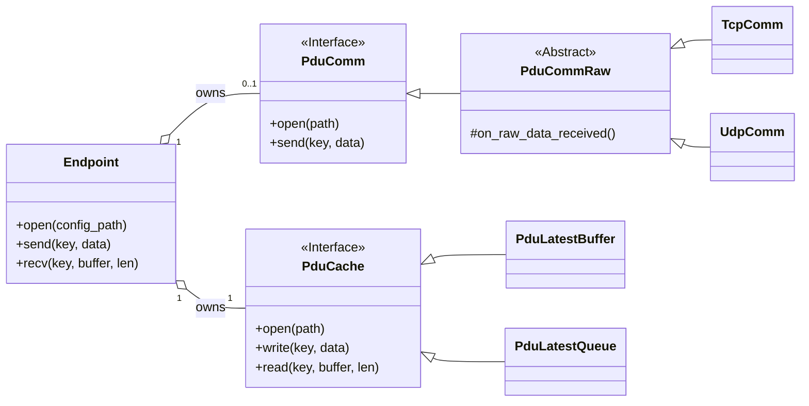

# hakoniwa-pdu-endpoint

`hakoniwa-pdu-endpoint` is a C++ library that provides a modular, file-based configuration for communication endpoints, designed for Hakoniwa PDU (Protocol Data Unit) communication. It allows for flexible setup by composing `Cache` and `Communication` modules via simple JSON files.

## Features

-   **Modular Endpoint Design**: An `Endpoint` is composed of a `Cache` module (for data storage) and a `Communication` module (for network I/O). This allows for flexible combinations, such as a TCP endpoint with a queue-based cache, or an in-memory-only buffer.
-   **JSON-based Configuration**: A hierarchical JSON configuration allows you to define an endpoint by linking to specific cache and communication settings.
-   **Multiple Cache Strategies**:
    -   **`latest` mode**: A state cache that stores only the most recent PDU for each channel.
    -   **`queue` mode**: An event queue that stores PDUs in a FIFO manner up to a configurable depth.
-   **Multiple Communication Protocols**:
    -   **TCP**: Client and Server roles for reliable, stream-based communication.
    -   **UDP**: Unicast, Broadcast, and Multicast for connectionless communication.
-   **Cross-platform**: Built with standard C++20 and CMake, making it portable across different operating systems.

## Requirements

-   C++20 compatible compiler (e.g., GCC, Clang, MSVC)
-   CMake (version 3.16 or later)
-   GoogleTest (for running tests, automatically fetched by CMake)

## How to Build

You can build the project using standard CMake commands.

1.  **Clone the repository**:
    ```bash
    git clone https://github.com/your-username/hakoniwa-pdu-endpoint.git
    cd hakoniwa-pdu-endpoint
    ```

2.  **Configure and build the project**:
    Create a `build` directory and run CMake and make.
    ```bash
    mkdir -p build
    cd build
    cmake ..
    make
    ```
    This will compile the static library `libhakoniwa_pdu_endpoint.a` into the `build/src` directory.

## How to Run Tests

The project includes a test suite built with GoogleTest. After a successful build, run the tests from the `build` directory:

```bash
ctest --verbose
```

You should see output indicating that all tests have passed.

## Configuration

The endpoint configuration is now modular, consisting of three parts: the main **Endpoint** config, a **Cache** config, and a **Communication** (`comm`) config.

The schemas for these can be found in `config/schema/`:
- `endpoint_schema.json`
- `cache_schema.json`
- `comm_schema.json`

### 1. Endpoint Configuration

This is the main entry point. It defines a named endpoint and links to the desired cache and communication configurations.

**`my_tcp_endpoint.json`**
```json
{
    "name": "my_tcp_endpoint",
    "cache": "config/sample/cache/queue.json",
    "comm": "config/sample/comm/tcp_server_inout_comm.json"
}
```
An endpoint for internal use (without a network component) can be defined by setting `comm` to `null`.
```json
{
    "name": "my_internal_buffer",
    "cache": "config/sample/cache/buffer.json",
    "comm": null
}
```

### 2. Cache Configuration

These files define the in-memory storage strategy.

#### "latest" Mode (State Cache)
Stores only the most recent PDU for each channel.
**`config/sample/cache/buffer.json`**
```json
{
  "type": "buffer",
  "name": "default_latest_buffer",
  "store": {
    "mode": "latest"
  }
}
```

#### "queue" Mode (Event Queue)
Maintains a FIFO queue of PDUs up to a specified `depth`.
**`config/sample/cache/queue.json`**
```json
{
  "type": "buffer",
  "name": "default_queue_buffer",
  "store": {
    "mode": "queue",
    "depth": 16
  }
}
```

### 3. Communication (Comm) Configuration

These files define the network protocol and parameters.

#### TCP Example
A bidirectional TCP server listening on port 7000.
**`config/sample/comm/tcp_server_inout_comm.json`**
```json
{
  "protocol": "tcp",
  "name": "tcp_server_inout",
  "direction": "inout",
  "role": "server",
  "local": {
    "address": "0.0.0.0",
    "port": 7000
  },
  "options": {
    "read_timeout_ms": 1000,
    "write_timeout_ms": 1000
  }
}
```

#### UDP Example
A bidirectional UDP endpoint listening on port 7777.
**`config/sample/comm/udp_inout_comm.json`**
```json
{
  "protocol": "udp",
  "name": "udp_inout",
  "direction": "inout",
  "pdu_key": { "robot": "TestRobo", "channel_id": 0 },
  "local": {
    "address": "0.0.0.0",
    "port": 7777
  },
  "options": {
    "buffer_size": 8192,
    "timeout_ms": 1000,
    "blocking": false
  }
}
```
For more examples, including UDP broadcast and multicast, please see the files in `config/sample/comm/`.

## Basic Usage

Here is a minimal example of how to use the `Endpoint` class.

```cpp
#include "hakoniwa/pdu/endpoint.hpp"
#include <iostream>
#include <vector>
#include <span>

int main() {

    // 1. Create an endpoint instance.

    hakoniwa::pdu::Endpoint endpoint("my_endpoint", HAKO_PDU_ENDPOINT_DIRECTION_INOUT);


    // 2. Open the endpoint with a configuration file.

    // This reads the config, creates and initializes the cache and comm modules.

    if (endpoint.open("path/to/my_endpoint.json") != HAKO_PDU_ERR_OK) {

        std::cerr << "Failed to open endpoint." << std::endl;

        return -1;

    }


    // 3. Start the endpoint (e.g., starts background threads for network I/O).

    if (endpoint.start() != HAKO_PDU_ERR_OK) {

        std::cerr << "Failed to start endpoint." << std::endl;

        return -1;

    }


    // 4. Use the endpoint to send and receive data.

    hakoniwa::pdu::PduResolvedKey key;

    key.robot = "my_robot";

    key.channel_id = 42;

    

    std::vector<std::byte> send_data = { std::byte(0x01), std::byte(0x02) };

    std::vector<std::byte> recv_buffer(1024);

    size_t received_size = 0;


    // Send data (writes to comm module, which sends over network).

    endpoint.send(key, send_data);


    // Receive data (reads from the internal cache, which is populated by the comm module).

    if (endpoint.recv(key, recv_buffer, received_size) == HAKO_PDU_ERR_OK) {

        std::cout << "Received " << received_size << " bytes." << std::endl;

    }


    // 5. Stop and close the endpoint.

    endpoint.stop();

    endpoint.close();


    return 0;

}

```


## Architectural Design


The library is built on a modular, layered architecture that emphasizes a strong separation of concerns. This design provides excellent versatility and extensibility.


### Class Diagram





### Design Principles


1.  **Separation of Concerns**: Each component has a single, well-defined responsibility.

    -   **`Endpoint`**: The user-facing orchestrator. It composes the cache and communication modules but knows nothing about their internal details (e.g., whether the cache is a queue or the communication is TCP).

    -   **`PduCache`**: An interface for in-memory data storage. Concrete implementations (`PduLatestBuffer`, `PduLatestQueue`) provide different caching strategies.

    -   **`PduCommRaw`**: An intermediate abstract layer that separates packet serialization/deserialization logic from the underlying transport mechanism.

    -   **`TcpComm`/`UdpComm`**: Concrete transport layers responsible only for sending and receiving raw bytes over the network.


2.  **Extensibility**: The design makes it easy to add new functionality without modifying existing core logic.

    -   **Adding a new protocol** (e.g., WebSocket): You would simply create a `WebSocketComm` class that inherits from `PduCommRaw` and implements the `raw_*` methods for sending/receiving bytes over a WebSocket. The `Endpoint` class would not need any changes.

    -   **Adding a new cache strategy** (e.g., a time-based cache): You can create a `TimeExpiringCache` class that inherits from `PduCache`. This new strategy can then be used by any endpoint, just by updating the JSON configuration.


3.  **Versatility through Composition**: By composing different cache and communication modules via JSON configuration, you can create a wide variety of endpoint types without writing new C++ code.

    -   **Reliable State Synchronizer**: Use a `TcpComm` with a `PduLatestBuffer` cache.

    -   **Lossy Event Streamer**: Use a `UdpComm` with a `PduLatestQueue` cache.

    -   **In-Memory Message Bus**: Use a `PduLatestQueue` with the `comm` module set to `null`.
