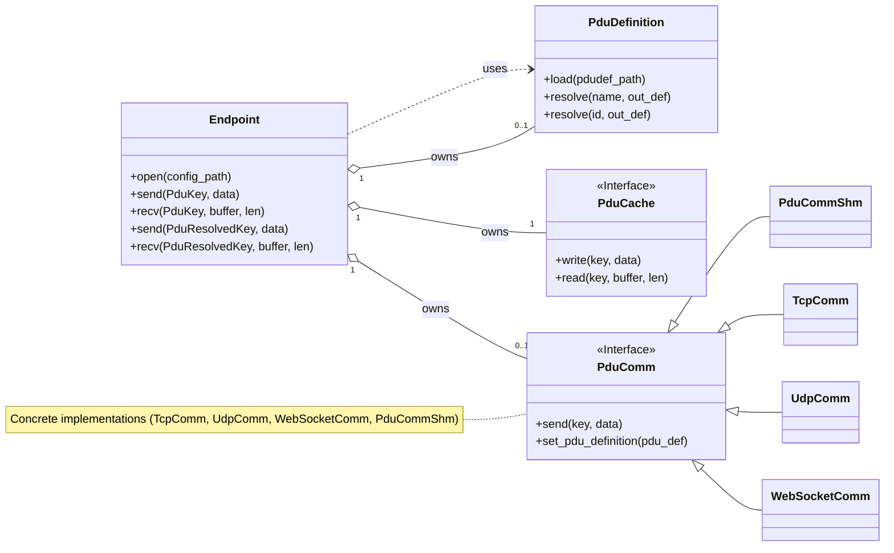

# hakoniwa-pdu-endpoint

`hakoniwa-pdu-endpoint` is a C++ library that provides a modular, file-based configuration for communication endpoints, designed for Hakoniwa PDU (Protocol Data Unit) communication. It allows for flexible setup by composing `Cache` and `Communication` modules via simple JSON files.

## Features

-   **Modular Endpoint Design**: An `Endpoint` is composed of a `Cache` module (for data storage) and a `Communication` module (for network I/O). This allows for flexible combinations.
-   **PDU Name Resolution (Optional)**: By providing a PDU definition file, the library can automatically resolve PDU names (strings) to their corresponding channel IDs and sizes, enabling a simpler, high-level API.
-   **JSON-based Configuration**: A hierarchical JSON configuration allows you to define an endpoint by linking to specific cache, communication, and optional PDU definition settings.
-   **Multiple Cache Strategies**:
    -   **`latest` mode**: A state cache that stores only the most recent PDU for each channel.
    -   **`queue` mode**: An event queue that stores PDUs in a FIFO manner up to a configurable depth.
-   **Multiple Communication Protocols**:
    -   **TCP**: Client and Server roles for reliable, stream-based communication.
    -   **UDP**: Unicast, Broadcast, and Multicast for connectionless communication.
    -   **Shared Memory (SHM)**: Event-driven communication for high-performance, local IPC with Hakoniwa assets.
    -   **WebSocket**: Client and Server roles for stream-based communication over WebSocket.
-   **Cross-platform**: Built with standard C++20 and CMake, making it portable across different operating systems.

## Requirements

-   C++20 compatible compiler (e.g., GCC, Clang, MSVC)
-   CMake (version 3.16 or later)
-   GoogleTest (for running tests, automatically fetched by CMake)
-   (Optional) Hakoniwa Core Library, if using Shared Memory (`comm_shm`) communication.

## How to Build

You can build the project using standard CMake commands.

1.  **Clone the repository**:
    ```bash
    git clone https://github.com/your-username/hakoniwa-pdu-endpoint.git
    cd hakoniwa-pdu-endpoint
    ```

2.  **Configure and build the project**:
    Create a `build` directory and run CMake and make.
    ```bash
    mkdir -p build
    cd build
    cmake ..
    make
    ```
    This will compile the static library `libhakoniwa_pdu_endpoint.a` into the `build/src` directory.

## How to Run Tests

The project includes a test suite built with GoogleTest. After a successful build, run the tests from the `build` directory:

```bash
ctest --verbose
```

You should see output indicating that all tests have passed.

## Configuration

The endpoint configuration is modular, consisting of up to four parts: the main **Endpoint** config, a **Cache** config, a **Communication** (`comm`) config, and an optional **PDU Definition** (`pdu_def`) config.

The schemas for these can be found in `config/schema/`:
- `endpoint_schema.json`
- `cache_schema.json`
- `comm_schema.json`
- `pdu_def_schema.json`

### 1. Endpoint Configuration

This is the main entry point. It defines an endpoint and links to the desired cache, communication, and (optionally) PDU definition configurations.

**Example with PDU Definition (for high-level API):**
```json
{
    "name": "my_shm_endpoint",
    "pdu_def_path": "config/sample/comm/hakoniwa/pdudef.json",
    "cache": "config/sample/cache/queue.json",
    "comm": "config/sample/comm/hakoniwa/shm_comm.json"
}
```

**Example without PDU Definition (for low-level API):**
```json
{
    "name": "my_tcp_endpoint",
    "cache": "config/sample/cache/queue.json",
    "comm": "config/sample/comm/tcp_server_inout_comm.json"
}
```

An endpoint for internal use (without a network component) can be defined by setting `comm` to `null`.
```json
{
    "name": "my_internal_buffer",
    "cache": "config/sample/cache/buffer.json",
    "comm": null
}
```

### 2. Cache Configuration

These files define the in-memory storage strategy (e.g., `latest` mode or `queue` mode). See `config/sample/cache/` for examples.

### 3. Communication (Comm) Configuration

These files define the network protocol and parameters. See `config/sample/comm/` for examples for TCP, UDP, SHM, and WebSocket.

### 4. PDU Definition File (Optional)

This file maps human-readable PDU names to their channel IDs, sizes, and types. Providing this file in the endpoint configuration enables the high-level, name-based API.
When using SHM communication, a PDU definition file is required so the shared-memory channel IDs can be resolved.

**`pdudef.json` (Excerpt):**
```json
{
    "robots": [
        {
            "name": "Drone",
            "shm_pdu_readers": [
                {
                    "type": "geometry_msgs/Twist",
                    "org_name": "pos",
                    "name": "Drone_pos",
                    "channel_id": 1,
                    "pdu_size": 72,
                    "method_type": "SHM"
                }
            ]
        }
    ]
}
```

## Basic Usage

The library offers two API levels depending on whether a PDU definition file is provided.

### High-Level API (Name-based)

This is the recommended approach when interacting with complex systems like Hakoniwa. By providing a `pdu_def_path` in your endpoint config, you can use string names for PDUs and let the library handle channel IDs and sizes automatically.

```cpp
#include "hakoniwa/pdu/endpoint.hpp"
#include <iostream>
#include <vector>

int main() {
    hakoniwa::pdu::Endpoint endpoint("my_endpoint", HAKO_PDU_ENDPOINT_DIRECTION_INOUT);

    // Open the endpoint with a config that includes "pdu_def_path"
    if (endpoint.open("path/to/my_shm_endpoint.json") != HAKO_PDU_ERR_OK) {
        std::cerr << "Failed to open endpoint." << std::endl;
        return -1;
    }

    // ... start the endpoint ...

    // Use the name-based PduKey
    hakoniwa::pdu::PduKey key;
    key.robot = "Drone";
    key.pdu = "pos"; // Use the string name from pdudef.json

    // The library knows the PDU size, so you can receive into a properly-sized buffer.
    std::vector<std::byte> recv_buffer(100); // Buffer must be large enough
    size_t received_size = 0;

    if (endpoint.recv(key, recv_buffer, received_size) == HAKO_PDU_ERR_OK) {
        std::cout << "Received " << received_size << " bytes for PDU 'pos'." << std::endl;
    }

    // ... stop and close ...
    return 0;
}
```

### Low-Level API (ID-based)

If you do not provide a `pdu_def_path`, you can still use the library by manually specifying the integer channel ID. This is suitable for simpler setups where you manage channel mappings yourself.

```cpp
#include "hakoniwa/pdu/endpoint.hpp"
#include <iostream>
#include <vector>

int main() {
    hakoniwa::pdu::Endpoint endpoint("my_endpoint", HAKO_PDU_ENDPOINT_DIRECTION_INOUT);

    // Open with a config that does NOT include "pdu_def_path"
    if (endpoint.open("path/to/my_tcp_endpoint.json") != HAKO_PDU_ERR_OK) {
        std::cerr << "Failed to open endpoint." << std::endl;
        return -1;
    }
    
    // ... start endpoint ...

    // Use the ID-based PduResolvedKey
    hakoniwa::pdu::PduResolvedKey key;
    key.robot = "my_robot";
    key.channel_id = 42; // Manually specify the channel ID

    std::vector<std::byte> send_data = { std::byte(0x01), std::byte(0x02) };
    endpoint.send(key, send_data);

    // ... stop and close ...
    return 0;
}
```

## Architectural Design

The library is built on a modular, layered architecture that emphasizes a strong separation of concerns. This design provides excellent versatility and extensibility.

### Class Diagram



### Design Principles

1.  **Separation of Concerns**: Each component has a single, well-defined responsibility.
    -   **`Endpoint`**: The user-facing orchestrator. It composes the other modules and provides two API levels (name-based and ID-based).
    -   **`PduDefinition`**: (Optional) Manages the mapping between PDU string names and their technical details (channel ID, size), loaded from a JSON file.
    -   **`PduCache`**: An interface for in-memory data storage. Concrete implementations provide different caching strategies.
    -   **`PduComm`**: An interface for communication modules. Concrete implementations (`TcpComm`, `UdpComm`, `WebSocketComm`, `PduCommShm`) handle the specifics of each protocol.

2.  **Extensibility**: The design makes it easy to add new functionality without modifying existing core logic.
    -   **Adding a new protocol**: You would simply create a new class that inherits from `PduComm` (e.g., `WebSocketComm`) and implement its methods. The `Endpoint` class would not need any changes.
    -   **Adding a new cache strategy**: You can create a new class that inherits from `PduCache`. This new strategy can then be used by any endpoint, just by updating the JSON configuration.

3.  **Versatility through Composition**: By composing different cache, communication, and PDU definition modules via JSON configuration, you can create a wide variety of endpoint types without writing new C++ code.
    -   **High-Level SHM Endpoint**: Use `PduCommShm` with a `PduDefinition` file for easy, name-based access to Hakoniwa shared memory.
    -   **Low-Level TCP Synchronizer**: Use a `TcpComm` with no `PduDefinition` to sync data between two endpoints using manually managed channel IDs.
    -   **In-Memory Message Bus**: Use a `PduLatestQueue` with the `comm` module set to `null`.
