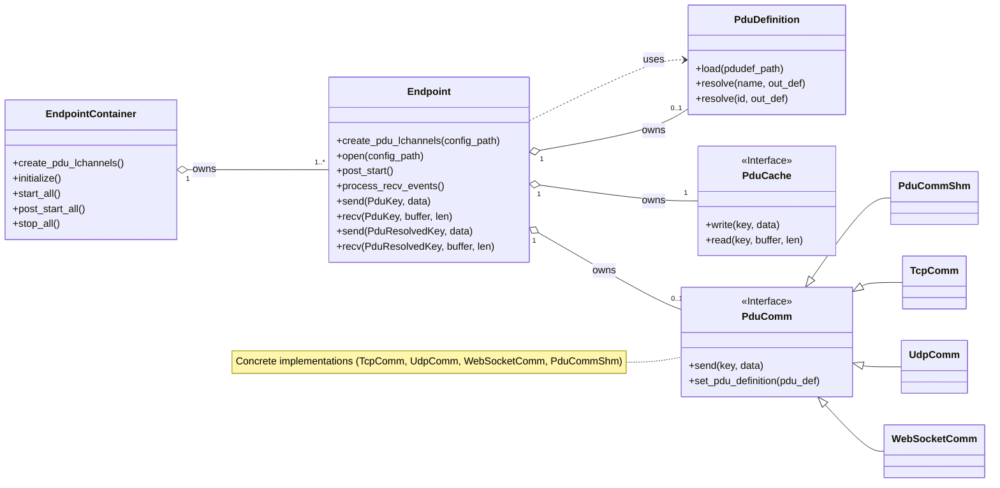

# hakoniwa-pdu-endpoint

`hakoniwa-pdu-endpoint` is a core infrastructure component for Hakoniwa distributed simulation. It is not “just a messaging library”: an Endpoint defines the causality boundary between simulation participants and makes semantics explicit. The design intentionally separates `Cache`, `Communication`, and optional `PDU Definition` so that lifetime, delivery, and meaning are never implicit.
For visual summaries, see `docs/diagrams/README.md`.

## Why Endpoint?

Hakoniwa systems often require many communication links (TCP/UDP/SHM/WebSocket) across multiple assets.
Without a common abstraction, each protocol tends to introduce its own lifecycle, configuration, and error handling.
The `Endpoint` abstraction provides one uniform API and configuration model that:
- decouples cache and transport concerns,
- makes protocol swaps a config change instead of a code change,
- and allows higher-level systems (like bridge orchestrators) to manage many links consistently.
It also enables network-free testing: you can set `comm: null` and use only the internal cache to simplify unit and integration tests.
Explicit configuration is a feature here: `cache` defines data lifetime and overwrite semantics; `comm` defines delivery guarantees and failure modes; `pdu_def` defines shared meaning of bytes (name → channel_id/size). Implicit behavior is rejected because it hides simulation semantics.
This design is intentionally biased toward large, multi-asset simulations: it favors long-term auditability and extensibility over a minimal first-run experience. Some APIs (e.g., SHM poll with `process_recv_events()`) expose integration control to fit external event loops, which is a deliberate trade-off rather than an accident.

## Features

-   **Modular Endpoint Design**: An `Endpoint` is composed of a `Cache` module (for data storage) and a `Communication` module (for network I/O). This allows for flexible combinations.
-   **PDU Name Resolution (Optional)**: By providing a PDU definition file, the library can automatically resolve PDU names (strings) to their corresponding channel IDs and sizes, enabling a simpler, high-level API.
-   **JSON-based Configuration**: A hierarchical JSON configuration allows you to define an endpoint by linking to specific cache, communication, and optional PDU definition settings.
-   **Multiple Cache Strategies**:
    -   **`latest` mode**: A state cache that stores only the most recent PDU for each channel.
    -   **`queue` mode**: An event queue that stores PDUs in a FIFO manner up to a configurable depth.
-   **Multiple Communication Protocols**:
    -   **TCP**: Client and Server roles for reliable, stream-based communication.
    -   **UDP**: Unicast, Broadcast, and Multicast for connectionless communication.
    -   **Shared Memory (SHM)**: Event-driven communication for high-performance, local IPC with Hakoniwa assets.
    -   **WebSocket**: Client and Server roles for stream-based communication over WebSocket.
-   **Cross-platform**: Built with standard C++20 and CMake, making it portable across different operating systems.

## Requirements

-   C++20 compatible compiler (e.g., GCC, Clang, MSVC)
-   CMake (version 3.16 or later)
-   Boost headers (header-only usage)
-   GoogleTest (for running tests, provided by your system package)
-   (Optional) Hakoniwa Core Library, if using Shared Memory (`comm_shm`) communication or Hakoniwa time sources.
    -   Expected install prefix: `/usr/local/hakoniwa` (headers in `/usr/local/hakoniwa/include`, libs in `/usr/local/hakoniwa/lib`)

## How to Build

You can build the project using standard CMake commands.

1.  **Clone the repository**:
    ```bash
    git clone https://github.com/hakoniwalab/hakoniwa-pdu-endpoint.git
    cd hakoniwa-pdu-endpoint
    ```

2.  **Configure and build the project**:
    Create a `build` directory and run CMake and make.
    ```bash
    cmake -S . -B build
    cmake --build build
    ```
    This will compile the static library `libhakoniwa_pdu_endpoint.a` into the `build/src` directory.

## Install / Uninstall

Install the headers and static library into `/usr/local/hakoniwa` (macOS / Ubuntu):

```bash
bash build.bash
sudo bash install.bash
```

Install destinations:

- Headers: `/usr/local/hakoniwa/include`
- Library: `/usr/local/hakoniwa/lib/libhakoniwa_pdu_endpoint.a`
- Python package (validators): `/usr/local/hakoniwa/share/hakoniwa-pdu-endpoint/python`

Uninstall (removes only the files installed by this project, including the Python validators):

```bash
sudo bash uninstall.bash
```

### Build Example (CMake)

```cmake
target_include_directories(app PRIVATE /usr/local/hakoniwa/include)
target_link_directories(app PRIVATE /usr/local/hakoniwa/lib)
target_link_libraries(app PRIVATE hakoniwa_pdu_endpoint)
```

## How to Run Tests

The project includes a test suite built with GoogleTest. After a successful build, run the tests from the `build` directory:

```bash
ctest --test-dir build --output-on-failure
```

You should see output indicating that all tests have passed.

## Configuration

The endpoint configuration is modular, consisting of up to four parts: the main **Endpoint** config, a **Cache** config, a **Communication** (`comm`) config, and an optional **PDU Definition** (`pdu_def`) config.

### Why so many configuration files?

Each file represents a separate semantic decision: storage lifetime/overwrite behavior (cache), delivery guarantees and failure modes (comm), and shared meaning of bytes (pdu_def). Keeping these decisions explicit avoids ambiguity and makes distributed-simulation causality auditable. Validators are provided to enforce this semantic clarity.

The schemas for these can be found in `config/schema/`:
- `endpoint_schema.json`
- `endpoint_container_schema.json`
- `cache_schema.json`
- `comm_schema.json`
- `pdu_def_schema.json`
- `pdudef.schema.json` (legacy or compact)
- `pdutypes.schema.json` (compact PDU list)

### Configuration Workflow

1. Create a cache config (e.g., `config/sample/cache/buffer.json` or `config/sample/cache/queue.json`).
2. Create a comm config (e.g., `config/sample/comm/tcp_server_inout_comm.json`).
3. Create a single endpoint config (e.g., `config/sample/endpoint.json`) that references the cache and comm files.
4. Optional: create a container config (e.g., `config/sample/endpoint_container.json`) to manage multiple endpoints under a `nodeId`.

You can validate configs with the JSON schema checker (after install, set `PYTHONPATH`):
```bash
export PYTHONPATH="/usr/local/hakoniwa/share/hakoniwa-pdu-endpoint/python:$PYTHONPATH"
python -m hakoniwa_pdu_endpoint.validate_json --schema config/schema/endpoint_schema.json --check-paths config/sample/endpoint.json
python -m hakoniwa_pdu_endpoint.validate_json --schema config/schema/endpoint_container_schema.json --check-paths config/sample/endpoint_container.json
python -m hakoniwa_pdu_endpoint.validate_pdudef config/sample/comm/hakoniwa
```

Python dependency for validators:
- `jsonschema` (install with `pip install jsonschema`)

Tutorials:
- `docs/tutorials/endpoint.md`


### 1. Endpoint Configuration

This is the main entry point. It defines an endpoint and links to the desired cache, communication, and (optionally) PDU definition configurations.

**Example with PDU Definition (for high-level API):**
```json
{
    "name": "my_shm_endpoint",
    "pdu_def_path": "config/sample/comm/hakoniwa/pdudef.json",
    "cache": "config/sample/cache/queue.json",
    "comm": "config/sample/comm/hakoniwa/shm_comm.json"
}
```

**Example without PDU Definition (for low-level API):**
```json
{
    "name": "my_tcp_endpoint",
    "cache": "config/sample/cache/queue.json",
    "comm": "config/sample/comm/tcp_server_inout_comm.json"
}
```

An endpoint for internal use (without a network component) can be defined by setting `comm` to `null`.
```json
{
    "name": "my_internal_buffer",
    "cache": "config/sample/cache/buffer.json",
    "comm": null
}
```

Additional endpoint examples are collected in `config/sample/endpoint_examples.json`.

### 1b. Endpoint Container Configuration

`EndpointContainer` uses a container file to map a `nodeId` to a list of endpoints.

**Example:**
```json
[
  {
    "nodeId": "node_1",
    "endpoints": [
      { "id": "ep_tcp_server", "config_path": "config/sample/endpoint_tcp_server.json" },
      { "id": "ep_udp_inout", "config_path": "config/sample/endpoint_udp_inout.json" }
    ]
  }
]
```

### 2. Cache Configuration

These files define the in-memory storage strategy (e.g., `latest` mode or `queue` mode). See `config/sample/cache/` for examples.

### 3. Communication (Comm) Configuration

These files define the network protocol and parameters. See `config/sample/comm/` for examples for TCP, UDP, SHM, and WebSocket.

### 4. PDU Definition File (Optional)

This file maps human-readable PDU names to their channel IDs, sizes, and types. Providing this file in the endpoint configuration enables the high-level, name-based API.
When using SHM communication, a PDU definition file is required so the shared-memory channel IDs can be resolved.

**Legacy `pdudef.json` (Excerpt):**
```json
{
    "robots": [
        {
            "name": "Drone",
            "shm_pdu_readers": [
                {
                    "type": "geometry_msgs/Twist",
                    "org_name": "pos",
                    "name": "Drone_pos",
                    "channel_id": 1,
                    "pdu_size": 72,
                    "method_type": "SHM"
                }
            ]
        }
    ]
}
```

**Compact format (recommended for new configs):**

This splits shared PDU definitions into a separate file and references them by ID, which avoids duplication when you have many robots with the same PDU set.
The schema treats a file as compact when it contains the `paths` field; otherwise it is validated as legacy.

`config/sample/comm/hakoniwa/new-pdudef.json`:
```json
{
  "paths": [
    { "id": "default", "path": "new-pdutypes.json" }
  ],
  "robots": [
    { "name": "Drone", "pdutypes_id": "default" },
    { "name": "Drone2", "pdutypes_id": "default" }
  ]
}
```

`config/sample/comm/hakoniwa/new-pdutypes.json`:
```json
[
  { "channel_id": 0, "pdu_size": 112, "name": "motor", "type": "hako_mavlink_msgs/HakoHilActuatorControls" },
  { "channel_id": 1, "pdu_size": 72, "name": "pos", "type": "geometry_msgs/Twist" }
]
```

We recommend using the compact format for new configurations to keep large robot fleets manageable.

### 5. Time Source Types

`create_time_source(type, delta_time_step_usec)` accepts the following `type` strings:

- `real`: Wall-clock time with `sleep_for` based on `delta_time_step_usec`.
- `virtual`: Manually advanced time.
- `hakoniwa`: Hakoniwa time source (defaults to poll behavior).
- `hakoniwa_poll`: Explicit poll implementation.
- `hakoniwa_callback`: Explicit callback implementation.

## Basic Usage

The library offers two API levels depending on whether a PDU definition file is provided.

### High-Level API (Name-based)

This is the recommended approach when interacting with complex systems like Hakoniwa. By providing a `pdu_def_path` in your endpoint config, you can use string names for PDUs and let the library handle channel IDs and sizes automatically.

```cpp
#include "hakoniwa/pdu/endpoint.hpp"
#include <iostream>
#include <vector>

int main() {
    hakoniwa::pdu::Endpoint endpoint("my_endpoint", HAKO_PDU_ENDPOINT_DIRECTION_INOUT);

    // Open the endpoint with a config that includes "pdu_def_path"
    if (endpoint.open("path/to/my_shm_endpoint.json") != HAKO_PDU_ERR_OK) {
        std::cerr << "Failed to open endpoint." << std::endl;
        return -1;
    }

    // ... start the endpoint ...

    // Use the name-based PduKey
    hakoniwa::pdu::PduKey key;
    key.robot = "Drone";
    key.pdu = "pos"; // Use the string name from pdudef.json

    // The library knows the PDU size, so you can receive into a properly-sized buffer.
    std::vector<std::byte> recv_buffer(100); // Buffer must be large enough
    size_t received_size = 0;

    if (endpoint.recv(key, recv_buffer, received_size) == HAKO_PDU_ERR_OK) {
        std::cout << "Received " << received_size << " bytes for PDU 'pos'." << std::endl;
    }

    // ... stop and close ...
    return 0;
}
```

## Examples

Example programs live in `examples/`. Build with `-DHAKO_PDU_ENDPOINT_BUILD_EXAMPLES=ON`.
See `examples/README.md` for usage.
These are minimal executable reference configurations (not tutorials). Use them as starting points, and validate any edits with the JSON schema tools described below.
See `FAQ.md` for design rationale and common questions.
See `docs/design_notes.md` for a concise summary of design trade-offs.
If you want “preset-style” configurations, see `config/sample/endpoint_examples.json` as a curated set of working combinations.
For a smooth first-run path, use: generator → validator → examples.
For a deeper discussion of configuration trade-offs (multi-file JSON vs single-file vs code-based), see `docs/design_tradeoffs.md`.

## Config Generator

A minimal generator is available for producing endpoint/comm config skeletons:

```bash
python -m hakoniwa_pdu_endpoint.gen_endpoint_config --protocol tcp --direction inout --role server --name demo --out-dir config/generated
```

Why this exists: it reduces boilerplate without hiding semantics. The generator never guesses semantic choices. The generator fills in protocol-specific basics and prints notes for any semantic decisions that should be chosen by the user (timeouts, pdu_def_path, etc.).

SHM example:
```bash
python -m hakoniwa_pdu_endpoint.gen_endpoint_config --protocol shm --direction inout --name shm_demo --shm-impl poll --shm-asset-name Asset --shm-pdu Pdu --out-dir config/generated
```

TCP (inout) examples:
- `examples/endpoint_tcp_server.cpp` uses `config/sample/endpoint_tcp_server.json`
- `examples/endpoint_tcp_client.cpp` uses `config/sample/endpoint_tcp_client.json`

UDP (one-way) examples:
- `examples/endpoint_udp_server.cpp` uses `config/tutorial/endpoint_udp_server.json`
- `examples/endpoint_udp_client.cpp` uses `config/tutorial/endpoint_udp_client.json`

WebSocket (inout) examples:
- `examples/endpoint_ws_server.cpp` uses `config/sample/endpoint_websocket_server.json`
- `examples/endpoint_ws_client.cpp` uses `config/sample/endpoint_websocket_client.json`

TCP mux example:
- `examples/endpoint_tcp_mux.cpp` uses `config/sample/endpoint_mux.json`

### Low-Level API (ID-based)

If you do not provide a `pdu_def_path`, you can still use the library by manually specifying the integer channel ID. This is suitable for simpler setups where you manage channel mappings yourself.

```cpp
#include "hakoniwa/pdu/endpoint.hpp"
#include <iostream>
#include <vector>

int main() {
    hakoniwa::pdu::Endpoint endpoint("my_endpoint", HAKO_PDU_ENDPOINT_DIRECTION_INOUT);

    // Open with a config that does NOT include "pdu_def_path"
    if (endpoint.open("path/to/my_tcp_endpoint.json") != HAKO_PDU_ERR_OK) {
        std::cerr << "Failed to open endpoint." << std::endl;
        return -1;
    }
    
    // ... start endpoint ...

    // Use the ID-based PduResolvedKey
    hakoniwa::pdu::PduResolvedKey key;
    key.robot = "my_robot";
    key.channel_id = 42; // Manually specify the channel ID

    std::vector<std::byte> send_data = { std::byte(0x01), std::byte(0x02) };
    endpoint.send(key, send_data);

    // ... stop and close ...
    return 0;
}
```

## Endpoint Comm Multiplexer (TCP Mux)

When you want a single server endpoint to accept multiple bridge connections, use the comm multiplexer.
This keeps the Endpoint API unchanged and reduces configuration declarations.

Key behavior:
- `take_endpoints()` is non-blocking; if no new connections are ready, it returns an empty vector.
- Returned endpoints are already `open()` and `start()`-ed and can be used immediately.
- Readiness is determined by `expected_clients` in the comm mux config.
- Endpoint names are generated as `<mux_name>_<seq>` (sequence starts at 1).
- `options` in the mux comm config follow the same keys as the standard TCP server comm config.
- In mux mode, `local` and `expected_clients` are used for accepting connections; session endpoints only use `direction`, `comm_raw_version`, and `options`.
- The JSON schema allows TCP mux configs via `expected_clients`.

### Example

`config/sample/endpoint_mux.json`:
```json
{
    "name": "tcp_mux",
    "cache": "cache/buffer.json",
    "comm": "comm/tcp_mux.json"
}
```

`config/sample/comm/tcp_mux.json`:
```json
{
  "protocol": "tcp",
  "name": "tcp_mux",
  "direction": "inout",
  "local": {
    "address": "0.0.0.0",
    "port": 54001
  },
  "expected_clients": 2,
  "options": {
    "read_timeout_ms": 1000,
    "write_timeout_ms": 1000
  }
}
```

```cpp
#include "hakoniwa/pdu/endpoint_comm_multiplexer.hpp"

int main() {
    hakoniwa::pdu::EndpointCommMultiplexer mux("tcp_mux", HAKO_PDU_ENDPOINT_DIRECTION_INOUT);
    if (mux.open("config/sample/endpoint_mux.json") != HAKO_PDU_ERR_OK) return -1;
    if (mux.start() != HAKO_PDU_ERR_OK) return -1;

    while (true) {
        auto endpoints = mux.take_endpoints();
        for (auto& ep : endpoints) {
            // ep is ready to use (open/start already called)
        }
        // ... do other work ...
    }
}
```

## Architectural Design

The library is built on a modular, layered architecture that emphasizes a strong separation of concerns. This design provides excellent versatility and extensibility.

### Key Classes and Lifecycle

-   **`EndpointContainer`**: Loads a container config (list of endpoints) for a given `nodeId`, opens each endpoint, and manages lifecycle in bulk.
    -   Typical flow: `create_pdu_lchannels()` (optional) → `initialize()` → `start_all()` → `post_start_all()` → `stop_all()`.
-   **`Endpoint` lifecycle**: `open()` configures cache/comm and loads optional PDU definitions.
    -   `create_pdu_lchannels()` pre-creates SHM channels when required by the comm implementation.
    -   `post_start()` is a post-start hook (used by SHM to register recv events).
    -   `process_recv_events()` is only meaningful for SHM poll implementations (others are no-op).

### API Notes

-   Name-based API (`send/recv(PduKey)`) requires `pdu_def_path`. Without it, these calls return `HAKO_PDU_ERR_UNSUPPORTED`.
-   ID-based API (`send/recv(PduResolvedKey)`) works without PDU definitions.
-   For `comm_shm` with `impl_type: "poll"`, you must call `Endpoint::process_recv_events()` periodically to dispatch receive callbacks.

### Class Diagram



### Design Principles

1.  **Separation of Concerns**: Each component has a single, well-defined responsibility.
    -   **`Endpoint`**: The user-facing orchestrator. It composes the other modules and provides two API levels (name-based and ID-based).
    -   **`PduDefinition`**: (Optional) Manages the mapping between PDU string names and their technical details (channel ID, size), loaded from a JSON file.
    -   **`PduCache`**: An interface for in-memory data storage. Concrete implementations provide different caching strategies.
    -   **`PduComm`**: An interface for communication modules. Concrete implementations (`TcpComm`, `UdpComm`, `WebSocketComm`, `PduCommShm`) handle the specifics of each protocol.

2.  **Extensibility**: The design makes it easy to add new functionality without modifying existing core logic.
    -   **Adding a new protocol**: You would simply create a new class that inherits from `PduComm` (e.g., `WebSocketComm`) and implement its methods. The `Endpoint` class would not need any changes.
    -   **Adding a new cache strategy**: You can create a new class that inherits from `PduCache`. This new strategy can then be used by any endpoint, just by updating the JSON configuration.

3.  **Versatility through Composition**: By composing different cache, communication, and PDU definition modules via JSON configuration, you can create a wide variety of endpoint types without writing new C++ code.
    -   **High-Level SHM Endpoint**: Use `PduCommShm` with a `PduDefinition` file for easy, name-based access to Hakoniwa shared memory.
    -   **Low-Level TCP Synchronizer**: Use a `TcpComm` with no `PduDefinition` to sync data between two endpoints using manually managed channel IDs.
    -   **In-Memory Message Bus**: Use a `PduLatestQueue` with the `comm` module set to `null`.
