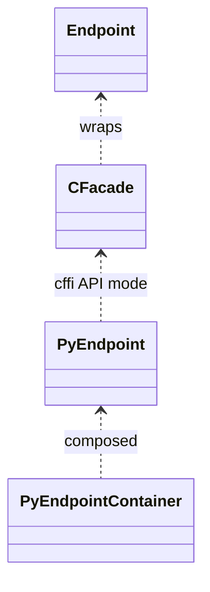
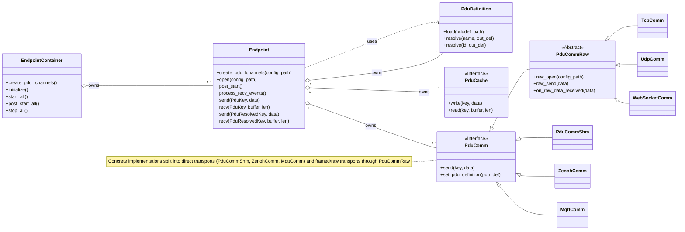

# hakoniwa-pdu-endpoint

[English](README.md) | [日本語](README.ja.md)

`hakoniwa-pdu-endpoint` is a core infrastructure component for Hakoniwa distributed simulation. It is not “just a messaging library”: an Endpoint defines the causality boundary between simulation participants and makes semantics explicit. The design intentionally separates `Cache`, `Communication`, and optional `PDU Definition` so that lifetime, delivery, and meaning are never implicit.
For visual summaries, see `docs/diagrams/README.md`.
This component targets teams building multi-asset simulations that require explicit semantics and auditability; it is intentionally heavier than a minimal messaging library. If you want a simple API with implicit defaults, this is not the right tool.
For a consolidated statement of intent, see `docs/design_philosophy.md`.

## What This Is Good At

This project is strongest when you need all of the following at once:

- explicit simulation semantics
- transport independence
- replayable and inspectable communication
- configuration-driven composition

In practice, that means:

- use `cache` to decide in-memory lifetime and overwrite behavior
- use `comm` to decide delivery or persistence behavior
- use `pdu_def` to make bytes semantically meaningful

The recent `StorageComm` work pushes this further:

- `storage.mode: "latest"` gives you a fixed-slot snapshot file, one current packet per key
- `storage.mode: "queue"` gives you an append-only log in receive order
- `recv(key, ...)` and `recv_next(...)` let the API reflect those two different semantics
- `hako_pdu_storage_debug` lets you inspect either file format from the command line
- `--json` output makes Python-side post-processing and custom parsers straightforward

The recent `ZenohComm` work extends the same endpoint model into dynamic pub/sub:

- peer-to-peer pub/sub is available without changing the endpoint API
- `PduResolvedKey` maps directly onto Zenoh key expressions
- loosely coupled assets can exchange PDU data without fixed TCP-style role wiring
- router-based deployment is still possible by changing the Zenoh native config, not the endpoint API

The recent `MqttComm` work extends the same endpoint model into broker-based pub/sub:

- cloud and IoT tooling that already speaks MQTT can exchange PDU data with Hakoniwa assets
- `PduResolvedKey` maps directly onto MQTT topics
- broker topology stays in comm config instead of leaking into the endpoint API
- callback-driven delivery remains consistent with the rest of the endpoint model

## Why Endpoint?

Hakoniwa systems often require many communication links (TCP/UDP/SHM/WebSocket) across multiple assets.
Without a common abstraction, each protocol tends to introduce its own lifecycle, configuration, and error handling.
The `Endpoint` abstraction provides one uniform API and configuration model that:
- decouples cache and transport concerns,
- makes protocol swaps a config change instead of a code change,
- and allows higher-level systems (like bridge orchestrators) to manage many links consistently.
It also enables network-free testing: you can set `comm: null` and use only the internal cache to simplify unit and integration tests.
Explicit configuration is a feature here: `cache` defines data lifetime and overwrite semantics; `comm` defines delivery guarantees and failure modes; `pdu_def` defines shared meaning of bytes (name → channel_id/size). Implicit behavior is rejected because it hides simulation semantics.
This design is intentionally biased toward large, multi-asset simulations: it favors long-term auditability and extensibility over a minimal first-run experience. Some APIs (e.g., SHM poll with `process_recv_events()`) expose integration control to fit external event loops, which is a deliberate trade-off rather than an accident.

## Features

-   **Modular Endpoint Design**: An `Endpoint` is composed of a `Cache` module (for data storage) and a `Communication` module (for network I/O). This allows for flexible combinations.
-   **PDU Name Resolution (Optional)**: By providing a PDU definition file, the library can automatically resolve PDU names (strings) to their corresponding channel IDs and sizes, enabling a simpler, high-level API.
-   **JSON-based Configuration**: A hierarchical JSON configuration allows you to define an endpoint by linking to specific cache, communication, and optional PDU definition settings.
-   **Multiple Cache Strategies**:
    -   **`latest` mode**: A state cache that stores only the most recent PDU for each channel.
    -   **`queue` mode**: An event queue that stores PDUs in a FIFO manner up to a configurable depth.
-   **Multiple Communication Protocols**:
    -   **TCP**: Client and Server roles for reliable, stream-based communication.
    -   **UDP**: Unicast, Broadcast, and Multicast for connectionless communication.
    -   **Shared Memory (SHM)**: Event-driven communication for high-performance, local IPC with Hakoniwa assets.
    -   **WebSocket**: Client and Server roles for stream-based communication over WebSocket.
    -   **Storage (File)**: Persistent communication backend for audit/replay use cases.
        - `mode: queue` stores every send as an append-only framed log and is consumed primarily with `recv_next(...)`.
        - `mode: latest` stores only the latest packet per `(robot, channel_id)` and is consumed primarily with `recv(key, ...)`.
        - both modes are self-describing via `StorageHeader`
        - both modes can be inspected with the C++ debug tool
-   **Replay / Inspection Tooling**:
        - `build/tools/hako_pdu_storage_debug` prints human-readable summaries of storage files
        - `--json` exposes offsets, sizes, keys, and timestamps for external tooling
-   **Zenoh Communication Support**:
        - `zenoh-c` can be fetched by CMake when Zenoh support is enabled
        - the requested version is controlled by `ZENOH_VERSION.txt`
        - peer-to-peer pub/sub is available through `ZenohComm`
        - `PduResolvedKey` maps directly to `<key_prefix>/<robot>/<channel_id>`
-   **MQTT Communication Support**:
        - Eclipse Paho MQTT C++ can be fetched by CMake when MQTT support is enabled
        - the requested version is controlled by `MQTT_VERSION.txt`
        - broker-based pub/sub is available through `MqttComm`
        - `PduResolvedKey` maps directly to `<topic_prefix>/<robot>/<channel_id>`
-   **Cross-platform**: Built with standard C++20 and CMake, making it portable across different operating systems.

## Requirements

-   C++20 compatible compiler (e.g., GCC, Clang, MSVC)
-   CMake (version 3.16 or later)
-   Boost headers (header-only usage)
    -   On Windows, the recommended path is `vcpkg` (`boost-headers:x64-windows`) and passing its toolchain file to CMake.
-   GoogleTest (for running tests, provided by your system package)
-   (Optional) Hakoniwa Core Library, if using Shared Memory (`comm_shm`) communication or Hakoniwa time sources.
    -   Expected install prefix: `/usr/local/hakoniwa` (headers in `/usr/local/hakoniwa/include`, libs in `/usr/local/hakoniwa/lib`)
    -   CMake option: `-DHAKO_PDU_ENDPOINT_ENABLE_HAKONIWA_CORE=ON|OFF`
    -   Core root override: `-DHAKO_PDU_ENDPOINT_HAKONIWA_CORE_ROOT=<path>`
    -   Default: `ON` on macOS/Linux, `OFF` on Windows

## How to Build

You can build the project using standard CMake commands.

1.  **Clone the repository**:
    ```bash
    git clone https://github.com/hakoniwalab/hakoniwa-pdu-endpoint.git
    cd hakoniwa-pdu-endpoint
    ```

2.  **Configure and build the project**:
    Create a `build` directory and run CMake and make.
    ```bash
    cmake -S . -B build
    cmake --build build
    ```
    This will compile the static library `libhakoniwa_pdu_endpoint.a` into the `build/src` directory.
    It also builds `build/tools/hako_pdu_storage_debug` by default.

To build a shared library for C# or other FFI-style runtimes:

```bash
cmake -S . -B build-shared -DBUILD_SHARED_LIBS=ON
cmake --build build-shared
```

Typical artifacts:

- macOS: `build-shared/src/libhakoniwa_pdu_endpoint.dylib`
- Linux: `build-shared/src/libhakoniwa_pdu_endpoint.so`
- Windows: `build-win/src/Release/hakoniwa_pdu_endpoint.dll`

### Helper Scripts

The repository also includes small helper scripts for common local workflows.

Core C++:

- build: `bash build.bash`
- test: `bash test.bash`

Python:

- build native + `cffi`: `bash build-python.bash`
- run Python smoke tests: `bash test-python.bash`
- Windows helper: `.\build-python-win.ps1`

C#:

- build shared native + managed projects: `bash build-csharp.bash`
- run C# smoke tests: `bash test-csharp.bash`
- Windows helpers:
  - `.\build-csharp-win.ps1`
  - `.\test-csharp-win.ps1`

### Windows (MSVC + PowerShell) Quick Build

If `.\build-win.ps1` fails with `Could not find ... BoostConfig.cmake`, install Boost via `vcpkg` and pass the toolchain file.

1.  **Install vcpkg and Boost headers**:
    ```powershell
    cd C:\project
    git clone https://github.com/microsoft/vcpkg.git
    cd vcpkg
    .\bootstrap-vcpkg.bat
    .\vcpkg.exe install boost-headers:x64-windows
    ```

2.  **Build this project with the vcpkg toolchain**:
    ```powershell
    cd C:\project\hakoniwa-pdu-endpoint
    .\build-win.ps1 -Clean `
      -BuildDirName build-win2 `
      -ToolchainFile C:\project\vcpkg\scripts\buildsystems\vcpkg.cmake `
      -VcpkgTriplet x64-windows `
      -Platform x64
    ```

3.  **Build with Hakoniwa Core integration (optional)**:
    ```powershell
    .\build-win.ps1 -Clean `
      -BuildDirName build-win2 `
      -ToolchainFile C:\project\vcpkg\scripts\buildsystems\vcpkg.cmake `
      -VcpkgTriplet x64-windows `
      -Platform x64 `
      -EnableHakoniwaCore `
      -HakoniwaCoreRoot C:\project\hakoniwa-core-pro\install
    ```

Notes:
- `build-win.ps1` defaults to `Release`. Use `-Configuration Debug` when needed.
- Default build directory is `build-win`. Override with `-BuildDirName <name>` (for example `build-win2`).
- Optional features are off by default on Windows too. Enable with `-EnableZenoh` and/or `-EnableMqtt`.
- Build a shared library for C#/PInvoke with `-BuildShared`.
- Hakoniwa Core integration (SHM + Hakoniwa time source) is `OFF` by default on Windows.
- To enable it, install Hakoniwa Core headers/libs and add `-EnableHakoniwaCore`.
- If Hakoniwa Core is in a custom location (for example `..\hakoniwa-core-pro\install`), also add `-HakoniwaCoreRoot <path>`.
- `build-win.ps1` now stops immediately when CMake configure fails, so dependency errors are easier to diagnose.
- Typical Windows artifacts:
  - `build-win2/src/Release/hakoniwa_pdu_endpoint.lib`
  - `build-win2/tools/Release/hako_pdu_storage_debug.exe`

## Quick Start For Storage

If you want to try the new persistence and replay-oriented features first, start here.

1. Build the project.

```bash
cmake -S . -B build
cmake --build build
```

2. Use one of the sample storage comm configs:

- `config/sample/comm/storage_latest_out_comm.json`
- `config/sample/comm/storage_queue_out_comm.json`

3. Write packets through an endpoint that uses `protocol: "storage"`.

4. Inspect the resulting file:

```bash
build/tools/hako_pdu_storage_debug path/to/storage_latest.bin
build/tools/hako_pdu_storage_debug path/to/storage_queue.bin
```

5. If you want offsets and metadata for Python-side tooling:

```bash
build/tools/hako_pdu_storage_debug path/to/storage_queue.bin --json > queue_index.json
build/tools/hako_pdu_storage_debug path/to/storage_latest.bin --json > latest_index.json
```

Choose the mode by purpose:

- `latest`: state snapshot, one current packet per key
- `queue`: replay log, append-only receive order

For the full storage format and API model, see `docs/storage_comm.md`.
For runnable storage examples, see `examples/README.md`.
For future work and design backlog, see `issue.md`.

## Quick Start For Zenoh

If you want to try dynamic pub/sub between endpoints without wiring TCP/UDP roles by hand, start here.

Why Zenoh in this project:

- choose it when you want pub/sub semantics instead of fixed client/server wiring
- choose it when assets should stay loosely coupled and discoverable through key expressions
- choose it when network topology may evolve and you do not want the application API to change
- choose it when peer-to-peer startup is more natural than introducing a dedicated router for the first run

1. Build with Zenoh enabled. The fetched `zenoh-c` version is pinned by `ZENOH_VERSION.txt`.

```bash
cmake -S . -B build-zenoh \
  -DHAKO_PDU_ENDPOINT_ENABLE_ZENOH=ON \
  -DHAKO_PDU_ENDPOINT_BUILD_EXAMPLES=ON
cmake --build build-zenoh -j4
```

2. Use the sample peer-to-peer configs.

- subscriber listens as peer: `config/sample/comm/zenoh/peer_listen.json5`
- publisher connects as peer: `config/sample/comm/zenoh/peer_connect.json5`
- router sample is also available: `config/sample/comm/zenoh/router.json5`

3. Start the subscriber endpoint.

```bash
./build-zenoh/examples/endpoint_zenoh_sub
```

4. Start the publisher endpoint in another terminal.

```bash
./build-zenoh/examples/endpoint_zenoh_pub
```

5. Confirm callback-driven delivery.

You should see the subscriber print `sample_state` updates as they arrive. This callback-driven delivery is controlled by `notify_on_recv` in the comm config (`zenoh.io.robots[].pdu[].notify_on_recv`). Set it to `true` for a key to have incoming Zenoh publications trigger the endpoint receive callback; omit it or set it to `false` to suppress callbacks for that key.

Example output:

```text
Waiting for Zenoh samples...
received sample_state=1
received sample_state=2
received sample_state=3
```

6. Run the integration test if you want a reproducible check.

```bash
./build-zenoh/test/endpoint_test \
  --gtest_filter=EndpointTest.ZenohCommPeerToPeerPubSubDeliversPayloadToCallback \
  --gtest_color=no
```

For runnable examples, see `examples/README.md`.
For schema details, see `config/schema/comm_schema.json`.

## Quick Start For MQTT

If you want broker-based pub/sub with a widely deployed transport, start here.

Why MQTT in this project:

- choose it when you want a broker-centric pub/sub topology instead of fixed client/server wiring
- choose it when cloud or IoT tooling already speaks MQTT and you want Hakoniwa endpoints to fit into that environment
- choose it when topic-based routing is enough and you do not need Zenoh key-expression features
- choose it when the application should keep the same endpoint API while the broker handles fan-out and retention

1. Build with MQTT enabled. The fetched `paho.mqtt.cpp` version is pinned by `MQTT_VERSION.txt`.

```bash
cmake -S . -B build-mqtt \
  -DHAKO_PDU_ENDPOINT_ENABLE_MQTT=ON \
  -DHAKO_PDU_ENDPOINT_BUILD_EXAMPLES=ON
cmake --build build-mqtt -j4
```

2. Start a local broker. The sample pair assumes `mosquitto` on `127.0.0.1:1883`.

```bash
mosquitto -p 1883
```

3. Start the subscriber endpoint in another terminal.

```bash
./build-mqtt/examples/endpoint_mqtt_sub
```

4. Start the publisher endpoint in a third terminal.

```bash
./build-mqtt/examples/endpoint_mqtt_pub
```

5. Confirm callback-driven delivery.

You should see the subscriber print `sample_state` updates as they arrive. MQTT receive delivery is callback-driven in the same way as Zenoh, but the routing unit is an MQTT topic derived from `<topic_prefix>/<robot>/<channel_id>`.

Example output:

```text
Waiting for MQTT samples...
received sample_state=1
received sample_state=2
received sample_state=3
```

6. Run the integration test if you want a reproducible check. It starts a temporary `mosquitto` broker when the executable is available in `PATH`.

```bash
./build-mqtt/test/endpoint_test \
  --gtest_filter=EndpointTest.MqttCommPubSubDeliversPayloadToCallback \
  --gtest_color=no
```

For runnable examples, see `examples/README.md`.
For schema details, see `config/schema/comm_schema.json`.

## Quick Start For Python

If you want to drive `Endpoint` from Python without embedding Python into the
core C++ runtime, start here.

This section is the shortest path to trying the Python runtime access. For the
environment/setup flow, see `Python Installation` below.

Why this matters in this project:

- Python can act as a first-class runtime client, not just a config tool
- the C facade keeps the portability boundary language-neutral
- `cffi` is used instead of `Python.h` embedding so Python-version coupling
  stays out of the core library
- callback-oriented Python code can stay safe by dispatching from a
  Python-owned thread

1. Build the core library first.

```bash
cmake -S . -B build
cmake --build build -j4
```

2. Build the `cffi` module into `build/python`.

```bash
python3 python/hakoniwa_pdu_endpoint/build_c_endpoint_ffi.py
```

3. Run the thin-wrapper smoke test.

```bash
python3 python/test/test_c_endpoint_smoke.py
```

4. Run the callback dispatch smoke test.

```bash
python3 python/test/test_c_endpoint_callback_smoke.py
```

5. Run the ROS-style callback smoke test.

```bash
python3 python/test/test_c_endpoint_ros_style_smoke.py
```

6. Run the runtime `recv_next` smoke test.

```bash
python3 python/test/test_c_endpoint_recv_next_smoke.py
```

7. Run the Python pending-count smoke test.

```bash
python3 python/test/test_c_endpoint_pending_smoke.py
```

8. Run the Python `EndpointContainer` smoke test.

```bash
python3 python/test/test_endpoint_container_smoke.py
```

Current Python layout:

- thin C ABI wrapper:
  - `python/hakoniwa_pdu_endpoint/c_endpoint.py`
- pure-Python container:
  - `python/hakoniwa_pdu_endpoint/endpoint_container.py`

Runnable Python examples are also provided:

- `python/examples/endpoint_internal_cache.py`
- `python/examples/endpoint_callback.py`
- `python/examples/endpoint_recv_next.py`
- `python/examples/endpoint_container.py`

For the C ABI details and ownership rules, see the `C Facade` section below.

If you want the repository helper scripts instead of manual steps:

```bash
bash build-python.bash
bash test-python.bash
```

## Quick Start For C#

If you want to use `Endpoint` from C# through the C facade boundary, start here.

Why this matters in this project:

- the native runtime stays language-neutral
- C# can use the same `Endpoint` model as C++ and Python
- Unity/Godot-oriented integration is possible without adding engine-specific code to the native layer
- runtime `recv_next(...)` is available for internal cache semantics as well as storage-backed use cases

1. Build the shared native library.

```bash
cmake -S . -B build-shared -DBUILD_SHARED_LIBS=ON
cmake --build build-shared --target hakoniwa_pdu_endpoint
```

2. Build the managed binding and examples.

```bash
bash build-csharp.bash
```

3. Run the C# smoke tests.

```bash
bash test-csharp.bash
```

4. Inspect the binding-level examples.

- `csharp/examples/MinimalExample/`
- `csharp/examples/ManualPumpExample/`
- `csharp/examples/RecvNextExample/`

5. For Unity/Godot-oriented setup and lifecycle guidance, see:

- `docs/csharp_engine_integration.md`

## Python Installation

Current Python support is source-tree based. There is no packaged wheel yet.

Install/use flow:

1. Build the core C++ library.

```bash
cmake -S . -B build
cmake --build build -j4
```

2. Install the Python dependency.

```bash
python3 -m pip install cffi
```

3. Build the `cffi` extension module.

```bash
python3 python/hakoniwa_pdu_endpoint/build_c_endpoint_ffi.py
```

4. Run Python with the repository `python/` directory on `PYTHONPATH`, or run
from the repository root as shown in the examples.

Example:

```bash
PYTHONPATH=python python3 python/examples/endpoint_internal_cache.py
```

Current Python modules:

- `hakoniwa_pdu_endpoint.c_endpoint`
- `hakoniwa_pdu_endpoint.endpoint_container`

An initial C# binding scaffold is also available under:

- `csharp/hakoniwa_pdu_endpoint/`
- `csharp/examples/`
- `csharp/tests/`

Current Python tests/examples:

- `python/test/test_c_endpoint_smoke.py`
- `python/test/test_c_endpoint_callback_smoke.py`
- `python/test/test_c_endpoint_ros_style_smoke.py`
- `python/test/test_c_endpoint_recv_next_smoke.py`
- `python/test/test_c_endpoint_pending_smoke.py`
- `python/test/test_endpoint_container_smoke.py`
- `python/examples/endpoint_internal_cache.py`
- `python/examples/endpoint_callback.py`
- `python/examples/endpoint_recv_next.py`
- `python/examples/endpoint_container.py`

Current C# tests/examples:

- `csharp/tests/SmokeTests/`
- `csharp/examples/MinimalExample/`
- `csharp/examples/ManualPumpExample/`
- `csharp/examples/RecvNextExample/`

## Install / Uninstall

Install the headers and static library into `/usr/local/hakoniwa` (macOS / Ubuntu):

```bash
bash build.bash
sudo bash install.bash
```

Install destinations:

- Headers: `/usr/local/hakoniwa/include`
- Library: `/usr/local/hakoniwa/lib/libhakoniwa_pdu_endpoint.a`
- Python package (validators): `/usr/local/hakoniwa/share/hakoniwa-pdu-endpoint/python`

The public C facade header is also installed under:

- `/usr/local/hakoniwa/include/hakoniwa/pdu/c_endpoint.h`

Uninstall (removes only the files installed by this project, including the Python validators):

```bash
sudo bash uninstall.bash
```

### Build Example (CMake)

```cmake
target_include_directories(app PRIVATE /usr/local/hakoniwa/include)
target_link_directories(app PRIVATE /usr/local/hakoniwa/lib)
target_link_libraries(app PRIVATE hakoniwa_pdu_endpoint)
```

### C Facade

The repository now includes a portable C facade for the `Endpoint` runtime:

- header: `include/hakoniwa/pdu/c_endpoint.h`
- implementation: `src/c_endpoint.cpp`

This is intended to become the stable ABI boundary for foreign-language access.
The current surface is:

- `create/destroy`
- `create_pdu_lchannels`
- `open/start/post_start/stop/close`
- `is_running`
- `process_recv_events`
- `send`
- `send_by_name`
- `subscribe_on_recv_callback`
- `subscribe_on_recv_callback_by_name`
- `recv`
- `recv_by_name`
- `recv_next`
- `get_pdu_size`
- `get_pdu_channel_id`
- `get_pdu_name`

Current design constraints:

- opaque handle based
- caller-owned buffers for `recv` and `recv_next`
- resolved-key-first API, with name-based helpers available when `pdu_def` is loaded
- callback payload pointers are borrowed for the duration of the callback only
- Python wrappers should copy callback payload bytes before returning from the callback

For the C# binding design intended for Unity/Godot-style main-thread dispatch,
see `docs/csharp_binding.md`.

For Unity/Godot-oriented C# setup and lifecycle guidance, see
`docs/csharp_engine_integration.md`.

The repository currently stops at the binding layer and examples.
Unity-specific or Godot-specific lifecycle adapters are intentionally left to application-side integration.

For the current Python binding design and callback model, see
`docs/python_binding.md`.

For the core runtime receive model across transports and cache modes, see
`docs/receive_semantics.md`.

That avoids running user Python logic directly on transport-facing callback
threads.

Current verification in this repository:

- C facade gtests:
  - `EndpointTest.CEndpointInternalCacheSendRecvWorks`
  - `EndpointTest.CEndpointStorageQueueRecvNextWorks`
  - `EndpointTest.CEndpointRecvReturnsNoSpaceWhenBufferTooSmall`
  - `EndpointTest.CEndpointRecvNextReturnsNoSpaceWhenBufferTooSmall`
  - `EndpointTest.CEndpointNameBasedApiWorks`
  - `EndpointTest.CEndpointResolvedKeyCallbackWorks`
- Python smoke test:
- Python smoke tests:
  - `python/test/test_c_endpoint_smoke.py`
  - `python/test/test_c_endpoint_callback_smoke.py`
  - `python/test/test_c_endpoint_ros_style_smoke.py`
  - `python/test/test_c_endpoint_recv_next_smoke.py`
  - `python/test/test_c_endpoint_pending_smoke.py`
  - `python/test/test_endpoint_container_smoke.py`
- C# smoke tests:
  - `csharp/tests/SmokeTests/`

### Python cffi Wrapper

A first `cffi` API-mode wrapper is provided under:

- `python/hakoniwa_pdu_endpoint/build_c_endpoint_ffi.py`
- `python/hakoniwa_pdu_endpoint/c_endpoint.py`

Typical flow:

```bash
python python/hakoniwa_pdu_endpoint/build_c_endpoint_ffi.py
python python/test/test_c_endpoint_smoke.py
python python/test/test_c_endpoint_callback_smoke.py
```

This assumes the core library has already been built and is available in the
repository build tree.

`c_endpoint.py` is the only Python binding entry point. It exposes the C facade
almost directly, while also carrying optional callback convenience helpers such
as `on_recv(...)`, `start_dispatch()`, and `stop_dispatch()`.

`cffi` was chosen instead of direct `Python.h` embedding or a `ctypes`-first
approach because:

- the runtime boundary stays a plain C ABI
- callback support can be added without pulling Python-specific logic into the
  core C++ library
- API/out-of-line mode keeps type checking tied to the C header owned by this
  project
- callback-heavy usage is safer to evolve than with a `ctypes`-only path

The repository includes callback and pull-model smoke tests:

- `python/test/test_c_endpoint_smoke.py`
- `python/test/test_c_endpoint_callback_smoke.py`
- `python/test/test_c_endpoint_ros_style_smoke.py`
- `python/test/test_c_endpoint_recv_next_smoke.py`
- `python/test/test_c_endpoint_pending_smoke.py`
- `python/test/test_endpoint_container_smoke.py`

### Python EndpointContainer

The repository also includes a pure-Python `EndpointContainer`:

- `python/hakoniwa_pdu_endpoint/endpoint_container.py`

This is intentionally implemented in Python rather than through a new C facade.
The existing C++ `EndpointContainer` is mostly lifecycle/config orchestration,
so Python can reproduce the same value cleanly by composing wrapped `Endpoint`
instances.

Current Python container responsibilities:

- load container config and select entries by `nodeId`
- resolve relative `config_path` values against the container file location
- `initialize`
- `create_pdu_lchannels`
- `start_all`
- `post_start_all`
- `stop_all`
- per-endpoint `start/post_start/stop/ref`

### Python Runtime View

The Python-facing structure is intentionally layered above the C facade instead
of reaching directly into C++:


```mermaid
classDiagram
    class Endpoint
    class CFacade
    class PyEndpoint
    class PyEndpointContainer

    Endpoint <.. CFacade : wraps
    CFacade <.. PyEndpoint : cffi API mode
    PyEndpoint <.. PyEndpointContainer : composed
```

### Python Scope Boundary

`EndpointCommMultiplexer` is intentionally not exposed to Python yet.

Reason:

- unlike `EndpointContainer`, it depends on lower-level session-accept logic
  that is not exposed through the current C facade
- reproducing it faithfully in Python would require new C APIs around mux
  session handoff
- it is more specialized than the current Python runtime access goal

## Zenoh Communication Support

Zenoh support is enabled by build option, but it is a first-class transport rather than an experimental side path.

Version source:

- `ZENOH_VERSION.txt`

Enable fetch/build:

```bash
cmake -S . -B build -DHAKO_PDU_ENDPOINT_ENABLE_ZENOH=ON
cmake --build build
```

Current behavior:

- CMake fetches `zenoh-c` from the version in `ZENOH_VERSION.txt`
- the project builds `ZenohComm`
- current scope is peer-to-peer pub/sub using `PduResolvedKey -> <key_prefix>/<robot>/<channel_id>`
- runnable examples:
  - `examples/endpoint_zenoh_pub.cpp`
  - `examples/endpoint_zenoh_sub.cpp`
  - `config/sample/endpoint_zenoh_pub.json`
  - `config/sample/endpoint_zenoh_sub.json`
- runnable test:
  - `EndpointTest.ZenohCommPeerToPeerPubSubDeliversPayloadToCallback`

Minimal config shape:

```json
{
  "protocol": "zenoh",
  "direction": "inout",
  "zenoh": {
    "config_path": "zenoh/peer_connect.json5",
    "key_prefix": "hakoniwa"
  }
}
```

Design split:

- Zenoh-native transport/session details live in the Zenoh config file referenced by `config_path`
- Hakoniwa-specific semantics stay in the endpoint comm config
- per-key receive notifications are configured under `zenoh.io.robots[].pdu[].notify_on_recv`
- sample pub/sub layout uses peer-to-peer config without `zenohd`
- subscriber listens as peer: `config/sample/comm/zenoh/peer_listen.json5`
- publisher connects as peer: `config/sample/comm/zenoh/peer_connect.json5`
- a router sample config is also provided at `config/sample/comm/zenoh/router.json5`

Current intent:

- today the documented happy path is peer-to-peer pub/sub because it is the smallest useful setup
- router-based deployment is still supported by supplying a Zenoh router config through `config_path`
- the Hakoniwa side remains stable because transport topology stays outside the endpoint API

## MQTT Communication Support

MQTT support is enabled by build option, but it is a first-class transport rather than an experimental side path.

Version source:

- `MQTT_VERSION.txt`

Enable fetch/build:

```bash
cmake -S . -B build-mqtt -DHAKO_PDU_ENDPOINT_ENABLE_MQTT=ON
cmake --build build-mqtt -j4
```

Current behavior:

- CMake fetches `paho.mqtt.cpp` from the version in `MQTT_VERSION.txt`
- the project builds `MqttComm`
- current scope is broker-based pub/sub using `PduResolvedKey -> <topic_prefix>/<robot>/<channel_id>`
- runnable examples:
  - `examples/endpoint_mqtt_pub.cpp`
  - `examples/endpoint_mqtt_sub.cpp`
  - `config/sample/endpoint_mqtt_pub.json`
  - `config/sample/endpoint_mqtt_sub.json`
- runnable test:
  - `EndpointTest.MqttCommPubSubDeliversPayloadToCallback`
- `recv(key, ...)` is still unsupported because MQTT is modeled as a push transport

Minimal config shape:

```json
{
  "protocol": "mqtt",
  "direction": "inout",
  "mqtt": {
    "broker": "tcp://127.0.0.1:1883",
    "topic_prefix": "hakoniwa"
  }
}
```

Design intent:

- MQTT belongs at the same transport/pub-sub layer as Zenoh
- broker topology should stay in comm config, not in the endpoint API
- `PduResolvedKey` should map directly to MQTT topics
- incoming publications should reach the endpoint through the receive callback path

Current intent:

- today the documented happy path is a local broker with one publisher and one subscriber because it is the smallest useful setup
- broker-side concerns such as authentication, retained messages, and deployment topology stay outside the endpoint API
- the Hakoniwa side remains stable because transport topology is expressed only in comm config

## How to Run Tests

The project includes a test suite built with GoogleTest. After a successful build, run the tests from the `build` directory:

```bash
ctest --test-dir build --output-on-failure
```

You should see output indicating that all tests have passed.

## Configuration

The endpoint configuration is modular, consisting of up to four parts: the main **Endpoint** config, a **Cache** config, a **Communication** (`comm`) config, and an optional **PDU Definition** (`pdu_def`) config.

### Why so many configuration files?

Each file represents a separate semantic decision: storage lifetime/overwrite behavior (cache), delivery guarantees and failure modes (comm), and shared meaning of bytes (pdu_def). Keeping these decisions explicit avoids ambiguity and makes distributed-simulation causality auditable. Validators are provided to enforce this semantic clarity.

The schemas for these can be found in `config/schema/`:
- `endpoint_schema.json`
- `endpoint_container_schema.json`
- `cache_schema.json`
- `comm_schema.json`
- `pdu_def_schema.json`
- `pdudef.schema.json` (legacy or compact)
- `pdutypes.schema.json` (compact PDU list)

### Configuration Workflow

1. Create a cache config (e.g., `config/sample/cache/buffer.json` or `config/sample/cache/queue.json`).
2. Create a comm config (e.g., `config/sample/comm/tcp_server_inout_comm.json`).
3. Create a single endpoint config (e.g., `config/sample/endpoint.json`) that references the cache and comm files.
4. Optional: create a container config (e.g., `config/sample/endpoint_container.json`) to manage multiple endpoints under a `nodeId`.

You can validate configs with the JSON schema checker (after install, set `PYTHONPATH`):
```bash
export PYTHONPATH="/usr/local/hakoniwa/share/hakoniwa-pdu-endpoint/python:$PYTHONPATH"
python -m hakoniwa_pdu_endpoint.validate_json --schema config/schema/endpoint_schema.json --check-paths config/sample/endpoint.json
python -m hakoniwa_pdu_endpoint.validate_json --schema config/schema/endpoint_container_schema.json --check-paths config/sample/endpoint_container.json
python -m hakoniwa_pdu_endpoint.validate_pdudef config/sample/comm/hakoniwa
```

Typical validation flow after generation:

```bash
python -m hakoniwa_pdu_endpoint.validate_json --schema config/schema/endpoint_schema.json --check-paths config/generated/endpoint_storage_demo.json
python -m hakoniwa_pdu_endpoint.validate_json --schema config/schema/endpoint_schema.json --check-paths config/generated/endpoint_zenoh_sub_demo.json
python -m hakoniwa_pdu_endpoint.validate_json --schema config/schema/endpoint_container_schema.json --check-paths config/generated/endpoint_container_demo.json
python -m hakoniwa_pdu_endpoint.validate_pdudef config/sample/comm/storage_example
```

Python dependency for validators:
- `jsonschema` (install with `pip install jsonschema`)

Tutorials:
- `docs/tutorials/endpoint.md`


### 1. Endpoint Configuration

This is the main entry point. It defines an endpoint and links to the desired cache, communication, and (optionally) PDU definition configurations.

**Example with PDU Definition (for high-level API):**
```json
{
    "name": "my_shm_endpoint",
    "pdu_def_path": "config/sample/comm/hakoniwa/pdudef.json",
    "cache": "config/sample/cache/queue.json",
    "comm": "config/sample/comm/hakoniwa/shm_comm.json"
}
```

**Example without PDU Definition (for low-level API):**
```json
{
    "name": "my_tcp_endpoint",
    "cache": "config/sample/cache/queue.json",
    "comm": "config/sample/comm/tcp_server_inout_comm.json"
}
```

An endpoint for internal use (without a network component) can be defined by setting `comm` to `null`.
```json
{
    "name": "my_internal_buffer",
    "cache": "config/sample/cache/buffer.json",
    "comm": null
}
```

Additional endpoint examples are collected in `config/sample/endpoint_examples.json`.

### 1b. Endpoint Container Configuration

`EndpointContainer` uses a container file to map a `nodeId` to a list of endpoints.

**Example:**
```json
[
  {
    "nodeId": "node_1",
    "endpoints": [
      { "id": "ep_tcp_server", "config_path": "config/sample/endpoint_tcp_server.json" },
      { "id": "ep_udp_inout", "config_path": "config/sample/endpoint_udp_inout.json" }
    ]
  }
]
```

### 2. Cache Configuration

These files define the in-memory storage strategy (e.g., `latest` mode or `queue` mode). See `config/sample/cache/` for examples.

### 3. Communication (Comm) Configuration

These files define the network protocol and parameters. See `config/sample/comm/` for examples for TCP, UDP, SHM, WebSocket, and Storage.

#### Storage comm (file backend)

Storage comm can be used for persistence-oriented pipelines.

- `protocol: "storage"`
- `storage.backend: "file"`
- `storage.mode: "queue" | "latest"`
- `storage.path`: output/input file path (resolved relative to comm config)

Recommended mental model:

- `latest`
  - state snapshot
  - one slot per `(robot, channel_id)`
  - fixed file size after `open()`
  - primary read API: `recv(key, ...)`
- `queue`
  - replay log
  - append-only receive-order frames
  - primary read API: `recv_next(...)`

Current file formats:

- `queue` stores a `StorageHeader` followed by repeated binary frames
- `latest` stores a `StorageHeader`, a fixed `StorageEntry[]` table, and a packet area

Sample configs:

- `config/sample/comm/storage_queue_out_comm.json`
- `config/sample/comm/storage_latest_out_comm.json`

Formal storage format and API notes:

- `docs/storage_comm.md`

This document covers:

- `latest` fixed-slot layout
- current `queue` framed-log layout
- `recv(key, ...)` vs `recv_next(...)`
- storage metadata design direction

Debug tool:

- `build/tools/hako_pdu_storage_debug <storage-file>`
- optional flags: `--limit N`, `--json`, `--verbose`
- prints a human-readable summary of `latest` and `queue` files
- `--json` prints a machine-readable index suitable for Python or replay tooling

Typical usage:

```bash
build/tools/hako_pdu_storage_debug path/to/storage_latest.bin
build/tools/hako_pdu_storage_debug path/to/storage_queue.bin --limit 20
build/tools/hako_pdu_storage_debug path/to/storage_queue.bin --json > queue_index.json
```

Future considerations for Storage and related extensions are tracked in `issue.md`.

Runnable examples:

- `config/sample/endpoint_storage_queue.json`
- `config/sample/endpoint_storage_latest.json`
- `examples/endpoint_storage_queue.cpp`
- `examples/endpoint_storage_latest.cpp`
- `examples/README.md`

Example commands:

```bash
./build/examples/endpoint_storage_queue
./build/examples/endpoint_storage_latest
```

#### Optional: host name resolver for TCP/UDP

For TCP/UDP comm configs, you can resolve host names (e.g. `srv-01`) via a local map file:

```json
{
  "protocol": "tcp",
  "direction": "out",
  "role": "client",
  "name_resolver": {
    "type": "file",
    "path": "../node-ip-map.json",
    "strict": false
  },
  "remote": {
    "address": "srv-01",
    "port": 64011
  }
}
```

Map file example:

```json
{
  "srv-01": "192.168.10.20",
  "cli-01": "192.168.10.21"
}
```

Notes:
- `path` is resolved relative to the comm config file.
- IP literals are used as-is and do not require mapping.
- `strict=true` makes unresolved host names a config error.

### 4. PDU Definition File (Optional)

This file maps human-readable PDU names to their channel IDs, sizes, and types. Providing this file in the endpoint configuration enables the high-level, name-based API.
When using SHM communication, a PDU definition file is required so the shared-memory channel IDs can be resolved.

**Legacy `pdudef.json` (Excerpt):**
```json
{
    "robots": [
        {
            "name": "Drone",
            "shm_pdu_readers": [
                {
                    "type": "geometry_msgs/Twist",
                    "org_name": "pos",
                    "name": "Drone_pos",
                    "channel_id": 1,
                    "pdu_size": 72,
                    "method_type": "SHM"
                }
            ]
        }
    ]
}
```

**Compact format (recommended for new configs):**

This splits shared PDU definitions into a separate file and references them by ID, which avoids duplication when you have many robots with the same PDU set.
The schema treats a file as compact when it contains the `paths` field; otherwise it is validated as legacy.

`config/sample/comm/hakoniwa/new-pdudef.json`:
```json
{
  "paths": [
    { "id": "default", "path": "new-pdutypes.json" }
  ],
  "robots": [
    { "name": "Drone", "pdutypes_id": "default" },
    { "name": "Drone2", "pdutypes_id": "default" }
  ]
}
```

`config/sample/comm/hakoniwa/new-pdutypes.json`:
```json
[
  { "channel_id": 0, "pdu_size": 112, "name": "motor", "type": "hako_mavlink_msgs/HakoHilActuatorControls" },
  { "channel_id": 1, "pdu_size": 72, "name": "pos", "type": "geometry_msgs/Twist" }
]
```

We recommend using the compact format for new configurations to keep large robot fleets manageable.

### 5. Time Source Types

`create_time_source(type, delta_time_step_usec)` accepts the following `type` strings:

- `real`: Wall-clock time with `sleep_for` based on `delta_time_step_usec`.
- `virtual`: Manually advanced time.
- `hakoniwa`: Hakoniwa time source (defaults to poll behavior).
- `hakoniwa_poll`: Explicit poll implementation.
- `hakoniwa_callback`: Explicit callback implementation.

## Basic Usage

The library offers two API levels depending on whether a PDU definition file is provided.

### High-Level API (Name-based)

This is the recommended approach when interacting with complex systems like Hakoniwa. By providing a `pdu_def_path` in your endpoint config, you can use string names for PDUs and let the library handle channel IDs and sizes automatically.

```cpp
#include "hakoniwa/pdu/endpoint.hpp"
#include <iostream>
#include <vector>

int main() {
    hakoniwa::pdu::Endpoint endpoint("my_endpoint", HAKO_PDU_ENDPOINT_DIRECTION_INOUT);

    // Open the endpoint with a config that includes "pdu_def_path"
    if (endpoint.open("path/to/my_shm_endpoint.json") != HAKO_PDU_ERR_OK) {
        std::cerr << "Failed to open endpoint." << std::endl;
        return -1;
    }

    // ... start the endpoint ...

    // Use the name-based PduKey
    hakoniwa::pdu::PduKey key;
    key.robot = "Drone";
    key.pdu = "pos"; // Use the string name from pdudef.json

    // The library knows the PDU size, so you can receive into a properly-sized buffer.
    std::vector<std::byte> recv_buffer(100); // Buffer must be large enough
    size_t received_size = 0;

    if (endpoint.recv(key, recv_buffer, received_size) == HAKO_PDU_ERR_OK) {
        std::cout << "Received " << received_size << " bytes for PDU 'pos'." << std::endl;
    }

    // ... stop and close ...
    return 0;
}
```

## Examples

Example programs live in `examples/`. Build with `-DHAKO_PDU_ENDPOINT_BUILD_EXAMPLES=ON`.
See `examples/README.md` for usage.
These are minimal executable reference configurations (not tutorials). Use them as starting points, and validate any edits with the JSON schema tools described below.
See `FAQ.md` for design rationale and common questions.
See `docs/design_notes.md` for a concise summary of design trade-offs.
If you want “preset-style” configurations, see `config/sample/endpoint_examples.json` as a curated set of working combinations.
For a smooth first-run path, use: generator → validator → examples. Treat generator + validator as the default workflow.
For a deeper discussion of configuration trade-offs (multi-file JSON vs single-file vs code-based), see `docs/design_tradeoffs.md`.

## Config Generator

A minimal generator is available for producing endpoint/comm config skeletons:

```bash
python -m hakoniwa_pdu_endpoint.gen_endpoint_config --protocol tcp --direction inout --role server --name demo --out-dir config/generated
```

Why this exists: it reduces boilerplate without hiding semantics. The generator never guesses semantic choices. The generator fills in protocol-specific basics and prints notes for any semantic decisions that should be chosen by the user (timeouts, pdu_def_path, transport-native config, etc.).

Preset mode (explicit, no inference):
```bash
python -m hakoniwa_pdu_endpoint.gen_endpoint_config --preset tcp_basic_server --name demo --out-dir config/generated
```

SHM example:
```bash
python -m hakoniwa_pdu_endpoint.gen_endpoint_config --protocol shm --direction inout --name shm_demo --shm-impl poll --shm-asset-name Asset --shm-pdu Pdu --out-dir config/generated
```

Storage example:
```bash
python -m hakoniwa_pdu_endpoint.gen_endpoint_config --protocol storage --direction out --name storage_demo --storage-mode queue --storage-path config/runtime/storage_demo.bin --out-dir config/generated
```

Zenoh example:
```bash
python -m hakoniwa_pdu_endpoint.gen_endpoint_config --protocol zenoh --direction in --name zenoh_sub_demo --zenoh-config-path config/sample/comm/zenoh/peer_listen.json5 --zenoh-pdu sample_state --robot StorageDemo --zenoh-notify-on-recv --pdu-def-path config/sample/comm/storage_example/pdudef.json --out-dir config/generated
```

MQTT example:
```bash
python -m hakoniwa_pdu_endpoint.gen_endpoint_config --protocol mqtt --direction in --name mqtt_sub_demo --mqtt-broker tcp://127.0.0.1:1883 --out-dir config/generated
```

Container example:
```bash
python -m hakoniwa_pdu_endpoint.gen_endpoint_config --protocol tcp --direction inout --role server --name demo --out-dir config/generated --generate-container --container-node-id node_demo
```

Supported generator targets:

- `tcp`
- `udp`
- `websocket`
- `shm`
- `storage`
- `zenoh`
- `mqtt`
- `internal_cache`
- `tcp_mux`

If `--generate-container` is set, the generator also writes a minimal `endpoint_container_*.json` that points to the generated endpoint config.

TCP (inout) examples:
- `examples/endpoint_tcp_server.cpp` uses `config/sample/endpoint_tcp_server.json`
- `examples/endpoint_tcp_client.cpp` uses `config/sample/endpoint_tcp_client.json`

UDP (one-way) examples:
- `examples/endpoint_udp_server.cpp` uses `config/tutorial/endpoint_udp_server.json`
- `examples/endpoint_udp_client.cpp` uses `config/tutorial/endpoint_udp_client.json`

WebSocket (inout) examples:
- `examples/endpoint_ws_server.cpp` uses `config/sample/endpoint_websocket_server.json`
- `examples/endpoint_ws_client.cpp` uses `config/sample/endpoint_websocket_client.json`

TCP mux example:
- `examples/endpoint_tcp_mux.cpp` uses `config/sample/endpoint_mux.json`

### Low-Level API (ID-based)

If you do not provide a `pdu_def_path`, you can still use the library by manually specifying the integer channel ID. This is suitable for simpler setups where you manage channel mappings yourself.

```cpp
#include "hakoniwa/pdu/endpoint.hpp"
#include <iostream>
#include <vector>

int main() {
    hakoniwa::pdu::Endpoint endpoint("my_endpoint", HAKO_PDU_ENDPOINT_DIRECTION_INOUT);

    // Open with a config that does NOT include "pdu_def_path"
    if (endpoint.open("path/to/my_tcp_endpoint.json") != HAKO_PDU_ERR_OK) {
        std::cerr << "Failed to open endpoint." << std::endl;
        return -1;
    }
    
    // ... start endpoint ...

    // Use the ID-based PduResolvedKey
    hakoniwa::pdu::PduResolvedKey key;
    key.robot = "my_robot";
    key.channel_id = 42; // Manually specify the channel ID

    std::vector<std::byte> send_data = { std::byte(0x01), std::byte(0x02) };
    endpoint.send(key, send_data);

    // ... stop and close ...
    return 0;
}
```

## Endpoint Comm Multiplexer (TCP Mux)

When you want a single server endpoint to accept multiple bridge connections, use the comm multiplexer.
This keeps the Endpoint API unchanged and reduces configuration declarations.

Key behavior:
- `take_endpoints()` is non-blocking; if no new connections are ready, it returns an empty vector.
- Returned endpoints are already `open()` and `start()`-ed and can be used immediately.
- Readiness is determined by `expected_clients` in the comm mux config.
- Endpoint names are generated as `<mux_name>_<seq>` (sequence starts at 1).
- `options` in the mux comm config follow the same keys as the standard TCP server comm config.
- In mux mode, `local` and `expected_clients` are used for accepting connections; session endpoints only use `direction`, `comm_raw_version`, and `options`.
- The JSON schema allows TCP mux configs via `expected_clients`.

### Example

`config/sample/endpoint_mux.json`:
```json
{
    "name": "tcp_mux",
    "cache": "cache/buffer.json",
    "comm": "comm/tcp_mux.json"
}
```

`config/sample/comm/tcp_mux.json`:
```json
{
  "protocol": "tcp",
  "name": "tcp_mux",
  "direction": "inout",
  "local": {
    "address": "0.0.0.0",
    "port": 54001
  },
  "expected_clients": 2,
  "options": {
    "read_timeout_ms": 1000,
    "write_timeout_ms": 1000
  }
}
```

```cpp
#include "hakoniwa/pdu/endpoint_comm_multiplexer.hpp"

int main() {
    hakoniwa::pdu::EndpointCommMultiplexer mux("tcp_mux", HAKO_PDU_ENDPOINT_DIRECTION_INOUT);
    if (mux.open("config/sample/endpoint_mux.json") != HAKO_PDU_ERR_OK) return -1;
    if (mux.start() != HAKO_PDU_ERR_OK) return -1;

    while (true) {
        auto endpoints = mux.take_endpoints();
        for (auto& ep : endpoints) {
            // ep is ready to use (open/start already called)
        }
        // ... do other work ...
    }
}
```

## Architectural Design

The library is built on a modular, layered architecture that emphasizes a strong separation of concerns. This design provides excellent versatility and extensibility.

### Key Classes and Lifecycle

-   **`EndpointContainer`**: Loads a container config (list of endpoints) for a given `nodeId`, opens each endpoint, and manages lifecycle in bulk.
    -   Typical flow: `create_pdu_lchannels()` (optional) → `initialize()` → `start_all()` → `post_start_all()` → `stop_all()`.
-   **`Endpoint` lifecycle**: `open()` configures cache/comm and loads optional PDU definitions.
    -   `create_pdu_lchannels()` pre-creates SHM channels when required by the comm implementation.
    -   `post_start()` is a post-start hook (used by SHM to register recv events).
    -   `process_recv_events()` is only meaningful for SHM poll implementations (others are no-op).

### API Notes

-   Name-based API (`send/recv(PduKey)`) requires `pdu_def_path`. Without it, these calls return `HAKO_PDU_ERR_UNSUPPORTED`.
-   ID-based API (`send/recv(PduResolvedKey)`) works without PDU definitions.
-   For `comm_shm` with `impl_type: "poll"`, you must call `Endpoint::process_recv_events()` periodically to dispatch receive callbacks.

### Class Diagram


```mermaid
classDiagram
    direction LR

    class Endpoint {
        +create_pdu_lchannels(config_path)
        +open(config_path)
        +post_start()
        +process_recv_events()
        +send(PduKey, data)
        +recv(PduKey, buffer, len)
        +send(PduResolvedKey, data)
        +recv(PduResolvedKey, buffer, len)
    }
    class EndpointContainer {
        +create_pdu_lchannels()
        +initialize()
        +start_all()
        +post_start_all()
        +stop_all()
    }

    class PduDefinition {
        +load(pdudef_path)
        +resolve(name, out_def)
        +resolve(id, out_def)
    }

    class PduCache {
        <<Interface>>
        +write(key, data)
        +read(key, buffer, len)
    }

    class PduComm {
        <<Interface>>
        +send(key, data)
        +set_pdu_definition(pdu_def)
    }
    class PduCommRaw {
        <<Abstract>>
        +raw_open(config_path)
        +raw_send(data)
        +on_raw_data_received(data)
    }

    class PduCommShm
    class TcpComm
    class UdpComm
    class WebSocketComm
    class ZenohComm
    class MqttComm

    Endpoint "1" o-- "0..1" PduDefinition : owns
    Endpoint "1" o-- "1" PduCache : owns
    Endpoint "1" o-- "0..1" PduComm : owns
    EndpointContainer "1" o-- "1..*" Endpoint : owns
    Endpoint ..> PduDefinition : uses

    PduComm <|-- PduCommRaw
    PduComm <|-- PduCommShm
    PduComm <|-- ZenohComm
    PduComm <|-- MqttComm
    PduCommRaw <|-- TcpComm
    PduCommRaw <|-- UdpComm
    PduCommRaw <|-- WebSocketComm
    
    note for PduComm "Concrete implementations split into direct transports (PduCommShm, ZenohComm, MqttComm) and framed/raw transports through PduCommRaw"

```

### Design Principles

1.  **Separation of Concerns**: Each component has a single, well-defined responsibility.
    -   **`Endpoint`**: The user-facing orchestrator. It composes the other modules and provides two API levels (name-based and ID-based).
    -   **`PduDefinition`**: (Optional) Manages the mapping between PDU string names and their technical details (channel ID, size), loaded from a JSON file.
    -   **`PduCache`**: An interface for in-memory data storage. Concrete implementations provide different caching strategies.
    -   **`PduComm`**: An interface for communication modules. Some transports implement it directly (`PduCommShm`, `ZenohComm`, `MqttComm`).
    -   **`PduCommRaw`**: A framed/raw transport adapter that sits between `PduComm` and byte-stream protocols. `TcpComm`, `UdpComm`, and `WebSocketComm` inherit from it so packet framing and `DataPacket` encode/decode logic stay shared.

2.  **Extensibility**: The design makes it easy to add new functionality without modifying existing core logic.
    -   **Adding a new protocol**: You would either inherit from `PduComm` directly (`ZenohComm`, `MqttComm`) or from `PduCommRaw` when the transport carries framed raw packets (`TcpComm`, `UdpComm`, `WebSocketComm`). The `Endpoint` class would not need any changes.
    -   **Adding a new cache strategy**: You can create a new class that inherits from `PduCache`. This new strategy can then be used by any endpoint, just by updating the JSON configuration.

3.  **Versatility through Composition**: By composing different cache, communication, and PDU definition modules via JSON configuration, you can create a wide variety of endpoint types without writing new C++ code.
    -   **High-Level SHM Endpoint**: Use `PduCommShm` with a `PduDefinition` file for easy, name-based access to Hakoniwa shared memory.
    -   **Low-Level TCP Synchronizer**: Use a `TcpComm` with no `PduDefinition` to sync data between two endpoints using manually managed channel IDs.
    -   **In-Memory Message Bus**: Use a `PduLatestQueue` with the `comm` module set to `null`.
