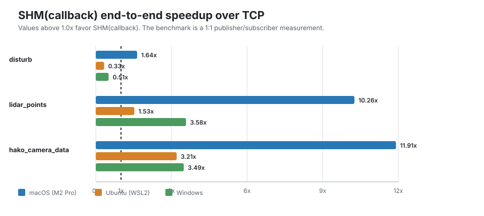

# Hakoniwa PDU Endpoint: 性能特性と設計意図

[English](PERFORMANCE.md) | [日本語](PERFORMANCE.ja.md)

---

## Hakoniwa とは

Hakoniwa は、サイバーフィジカルシステム向けのオープンソースな
シミュレーションハブです。flight controller、センサーモデル、
可視化ツール、外部アプリケーションといった異種のシミュレーション
モデルを、共有された仮想環境を介して接続することを目的としています。
モデル間の通信は Hakoniwa PDU エンドポイント層を経由し、TCP と
共有メモリ（SHM）の両バックエンドをサポートしています。

---

## なぜ transport 性能が重要か

シミュレーションハブで支配的になりやすいのは、小さな制御信号だけでは
ありません。カメラ画像（約 1 MB/フレーム）や LiDAR 点群（約 177 KB/スキャン）
といった大きなセンサーの通信データを、シミュレーションの各ステップで
配送する必要があります。

配送パターンも同様に重要です。1 つのセンサーの送信側が、flight controller、
障害物検知、可視化ツールなど複数の受信側へ同時にデータを届けることは
ごく自然です。これが 1:n 配送パターンです。TCP では受信側が増えるほど
送信側のデータ転送量も比例して増えます。一方 SHM(callback) は通信データを
共有メモリへ一度書き込んで受信側に通知するため、n が増えても送信側の
転送量は変わりません。`report.md` の性能測定は 1:1 構成を対象としているため、
この 1:n でのスケール特性は含まれていません。

---

## Benchmark 概要

詳細な測定条件、タイミングの生データ、プラットフォームごとの環境情報は
[`report.md`](report.md) を参照してください。

次の表は、3 つのプラットフォームと 3 つの通信データサイズにおける、
TCP に対する SHM(callback) のエンドツーエンドの速度比をまとめたものです。

| PDU | Payload | macOS (M2 Pro) | Ubuntu (WSL2) | Windows |
| --- | ---: | ---: | ---: | ---: |
| `disturb` | 256 B | 1.64x | 0.33x | 0.51x |
| `lidar_points` | 177 KB | 10.26x | 1.53x | 3.58x |
| `hako_camera_data` | 1 MB | 11.91x | 3.21x | 3.49x |

1.0 より大きい値は SHM(callback) が有利であることを示します。
1.0 より小さい値は TCP が有利であることを示します。
すべての測定はすべてのプラットフォームで通信データの欠落なく完了しています。

---

## 主な結果

- 大きな通信データでは、SHM(callback) はすべてのプラットフォームで TCP を
  大幅に上回りました。1:1 の性能測定条件において、macOS ではエンドツーエンドの
  速度比が最大 11.91 倍、送信側スループットが最大 16.65 倍に達しています。
- macOS の結果は Apple Silicon の Unified Memory アーキテクチャの恩恵を
  受けています。CPU プロセスが同じ物理メモリプールを共有しており、
  キャッシュコヒーレンシのオーバーヘッドが小さいためです。Ubuntu（WSL2）と
  Windows の結果は、それぞれの OS の共有メモリ API と、WSL2 の場合は
  仮想化レイヤーの影響を反映しています。
- 小さな通信データ（256 バイト）では、Ubuntu と Windows において
  SHM(callback) が TCP より遅くなります。これは想定される挙動であり、
  不具合ではありません。
- 性能測定は 1:1 配送を対象としています。Hakoniwa の主要な 1:n ユースケースでは、
  複数の TCP ストリームへ個別に送信する代わりに通信データを共有メモリへ
  一度だけ書き込めるため、送信側では SHM(callback) がさらに有利になる
  可能性があります。

---

## なぜ小さな payload では TCP が有利になるのか: 実装視点

SHM(callback) の経路には、通信データのサイズに依存しない固定コストが
いくつかあります。

- **受信イベントのディスパッチ**: `call_recv_event_callbacks()` は登録済みの
  受信イベントエントリを先頭から線形に走査します。この性能測定では
  1024 チャンネルが有効なため、小さな通信データではこの走査が支配的になります。
- **共有メモリからの読み戻しコピー**: コールバック経路では、ユーザーコールバックを
  呼び出す前に、共有メモリのスロットから受信バッファへ PDU を読み戻します。
  ゼロコピーの配送ではありません。
- **同期オーバーヘッド**: 現在の実装では、受信のたびにアトミックフラグの確認、
  mutex の取得、PDU 定義の解決が発生します。
- **性能測定自体のコスト**: メッセージごとのタイムスタンプ取得とログの
  バッファリングは、両バックエンドに共通する小さくても無視できない固定コストです。

大きな通信データでは、これらのコストはデータ転送時間に対して相対的に小さく
なります。256 バイトの通信データでは、これらが支配的になります。
これは現在の実装における構造的な性質であり、性能上の不具合ではありません。

通信データが 256 バイトしかない場合、性能測定自体のコストは両バックエンドに
等しく掛かりますが、SHM(callback) 固有のディスパッチと共有メモリの
読み戻しコストが相対的に大きく見えるようになります。

---

## 設計意図

Hakoniwa でのトランスポート選択は、単一の推奨バックエンドに依るのではなく、
通信データのサイズと配送パターンによって決まります。

TCP は小さな制御信号やコマンドメッセージに適しています。バックプレッシャーに
よる流量制御で送信側と受信側の進行が自然に揃い、固定コストも通信データに
対して小さいためです。

SHM(callback) は大きなセンサーの通信データ、特に 1 つの送信側が複数の受信側へ
配信する場合に適しています。共有メモリへ一度書き込むことで、n 本の TCP
ストリームへ個別送信する場合と比べて送信側の転送量を抑えられます。一方で、
受信側のコールバックディスパッチと読み戻し処理は受信側の数に応じて増えます。
テストしたすべてのプラットフォームで得られる高いメモリ帯域幅が、大きな
通信データの転送を高速にしています。

ここで報告している SHM(callback) の性能は 1:1 構成での測定です。センサー
チャンネルごとに複数の受信側が存在する実運用のシミュレーションシナリオは
別途評価する必要がありますが、トランスポートの設計としては、送信側から TCP
で繰り返し送信するよりも、大きな通信データの 1:n 配送を効率化することを
意図しています。

---

## 今後の改善方向

以下の改善点が確認されており、将来のリリースで対応される可能性があります。

- **受信イベントのインデックス化**: `call_recv_event_callbacks()` の線形走査を、
  チャンネル ID からイベントエントリへの直接インデックスに置き換え、
  チャンネル数が多い場合のディスパッチコストを削減する。
- **コールバックのファストパス**: PDU 定義とエンドポイントのメタデータを
  受信のたびに解決するのではなく、サブスクリプション時にあらかじめ解決しておき、
  ホットパスでの繰り返しの map 検索と解決処理を削減する。
- **ゼロコピーコールバック API**: 受信バッファへのコピーを行わず、
  共有メモリのビューをコールバックへ直接渡す。ただし、ライフタイムと
  同期の設計を慎重に扱う必要があるため、別の opt-in API として導入する。
- **性能測定のサマリーモード**: メッセージごとのログ記録をオプションにし、
  スループット測定でトランスポートのコストと計測コストを分離できるようにする。
