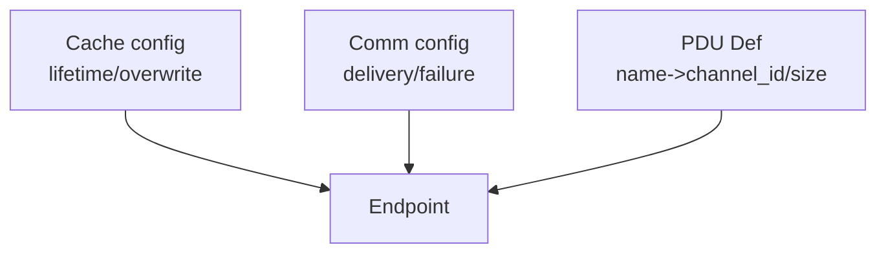

# Design Trade-offs

## Context

This component prioritizes explicit simulation semantics and auditability over minimal configuration.
It treats configuration as executable documentation, not as a convenience layer.

## Core Choice

Three approaches are possible:

- **Multi-file JSON (this project)**
  - Separate files for cache, comm, and optional pdu_def.
- **Single-file JSON**
  - All decisions co-located in one config file.
- **Code-based builder API**
  - Semantics expressed in code at compile time.

The choice here is intentional: semantic decisions remain explicit and swappable at runtime.

## ASCII Sketch

```
Semantic Decisions
  [Cache]   [Comm]   [PDU Def]
     \        |        /
        -> Endpoint ->

Single file:   [ Cache + Comm + PDU Def ]
Code builder:  buildEndpoint(cache, comm, pduDef)
```

## Trade-offs

- **Runtime flexibility**
  - Multi-file JSON: high (swap cache/comm without recompilation)
  - Single-file JSON: medium (still runtime, but more coupled)
  - Code-based builder: low (requires rebuild/redeploy)

- **Auditability**
  - Multi-file JSON: high (each file is a focused semantic decision)
  - Single-file JSON: medium (decisions are co-located but mixed)
  - Code-based builder: low to medium (requires code review + build context)

- **Validation / tooling**
  - Multi-file JSON: strong (schema validators, path checks, generators)
  - Single-file JSON: possible, but less modular
  - Code-based builder: relies on compiler and tests, weaker schema-level guarantees

- **Coupling**
  - Multi-file JSON: low (cache/comm/pdu_def can evolve independently)
  - Single-file JSON: medium (tends to grow into monolith)
  - Code-based builder: high (semantics and code evolve together)

- **Learning cost**
  - Multi-file JSON: higher upfront (multiple files, references)
  - Single-file JSON: lower upfront
  - Code-based builder: depends on codebase, usually medium

## Practical Guidance

**When multi-file JSON is the right fit**
- You need explicit causality and delivery semantics.
- Multiple assets or endpoints must be audited or reviewed independently.
- You want to swap transports (TCP/UDP/SHM/WebSocket) without recompilation.
- You use generators/validators in CI to enforce correctness.

**When to avoid it**
- You only need a small, fixed TCP/UDP setup.
- You prefer implicit defaults over explicit semantics.
- You cannot tolerate multi-file configuration or external validation tools.

## Debated Pain Points

**1) “File jumping / fragmented readability”**
- This is a real cost of explicit separation.
- The counterbalance is that each file is small and scoped to one decision.
- Tooling (examples, generator, validators) is expected to make navigation routine.

**2) “`pdu_def_path` presence affects API level”**
- Name-based API requires an explicit PDU definition to ensure shared meaning.
- Validators catch missing or invalid paths early; SHM requires PDU definitions by design.
- This favors runtime declarative composition over compile-time enforcement.
- Recommended workflow: generator → validator (with `--check-paths`) → CI.

## Optional Diagram


