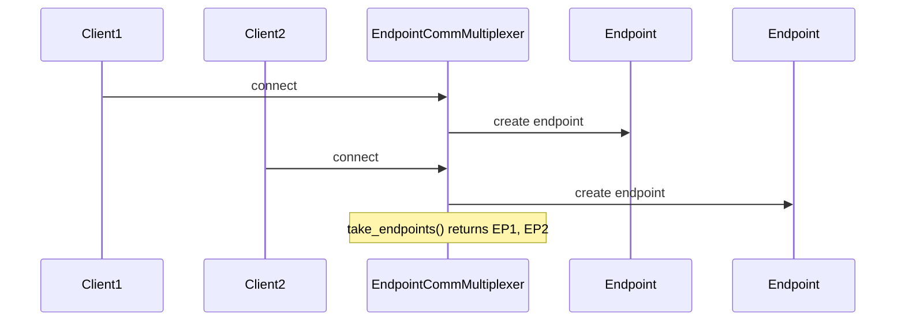

# TCP Mux Flow

```mermaid
sequenceDiagram
  participant Client1
  participant Client2
  participant Mux as EndpointCommMultiplexer
  participant EP1 as Endpoint #1
  participant EP2 as Endpoint #2

  Client1->>Mux: connect
  Mux->>EP1: create endpoint
  Client2->>Mux: connect
  Mux->>EP2: create endpoint
  Note over Mux: take_endpoints() returns EP1, EP2
```
