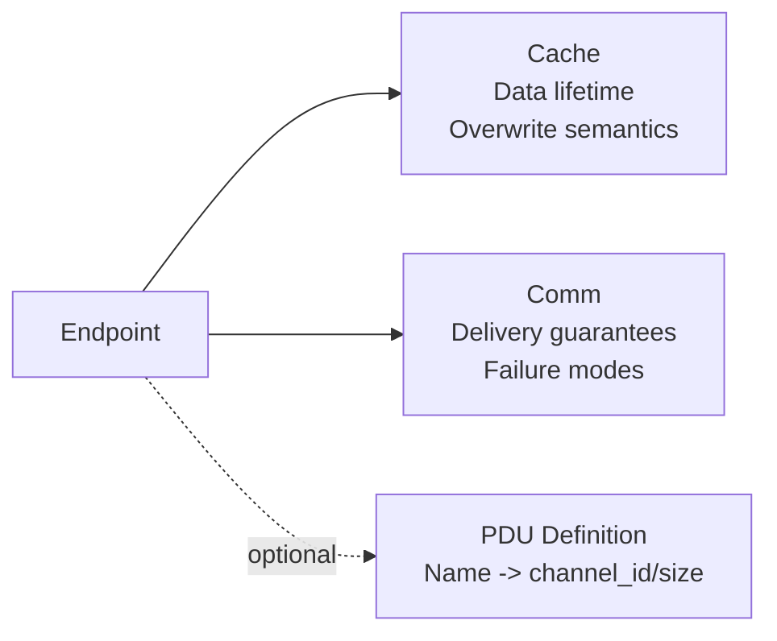

# Semantics Separation

```mermaid
flowchart LR
  Endpoint[Endpoint]
  Cache[Cache
Data lifetime
Overwrite semantics]
  Comm[Comm
Delivery guarantees
Failure modes]
  PDU[PDU Definition
Name -> channel_id/size]

  Endpoint --> Cache
  Endpoint --> Comm
  Endpoint -. optional .-> PDU
```
