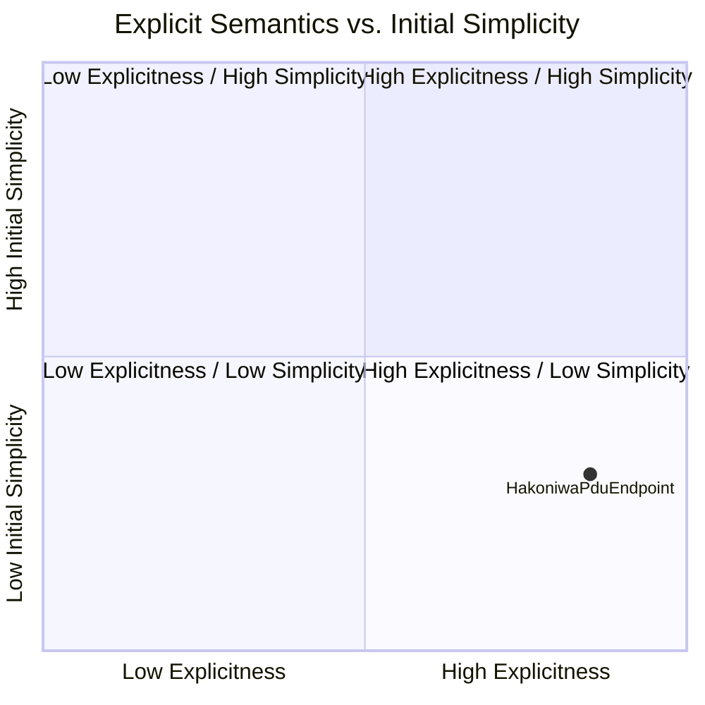

# Trade-off: Explicitness vs. Simplicity

```mermaid
quadrantChart
  title Explicit Semantics vs. Initial Simplicity
  x-axis Low Explicitness --> High Explicitness
  y-axis Low Initial Simplicity --> High Initial Simplicity
  quadrant-1 High Explicitness / High Simplicity
  quadrant-2 Low Explicitness / High Simplicity
  quadrant-3 Low Explicitness / Low Simplicity
  quadrant-4 High Explicitness / Low Simplicity
  HakoniwaPduEndpoint: [0.85, 0.30]
```
